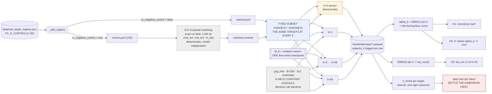
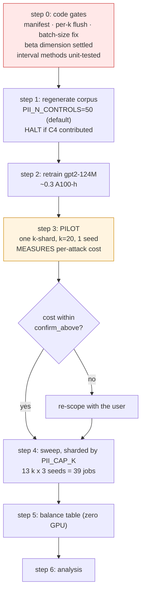

# Preregistration — capacity_axis_20260902

_The E3 capacity sweep. Type: `experiment`. Status: in design._

> Written section by section during the design stage; each confirmed section replaces one
> `_pending_` marker. Preregistration exists because once results are visible, every human being
> alive — including the author — will find a story that fits them. Fixing the hypothesis, the metric,
> and the test beforehand costs nothing now and cannot be done afterwards.

## Lineage — this is a revival, not a new design

This experiment was designed once before, as `capacity_response_20260831`, and abandoned on
2026-09-01 without spending compute. That archive's own closing instruction was explicit:

> "If the capacity sweep is revived, start from this design and fix the two problems above — do not
> rewrite the hypotheses from scratch."

**H1, H2, H3, the prediction, and `## What the Answer Changes` below are carried over verbatim from
that design.** They were fixed in advance, and rewriting them now — after a month of intervening
analysis — would destroy the only thing that makes a recorded prediction worth anything.

What has changed is that all three abandonment reasons now have concrete fixes:

| Abandonment reason (2026-09-01) | Status now |
|---|---|
| **1.** H2 needed `α_k ≤ 1%`, but 50 control individuals cap the rule-of-three upper bound — the threshold could be neither met nor refuted | **Dissolved, not bought.** The threshold was never load-bearing: none of this study's three deliverables — the shape, `β`, the auditor procedure — depends on α being resolved at 1%, and α belongs to the auditor rather than to this paper. The 1% text is retained verbatim and scored at the resolution limit; the study delivers the whole `α → k*(α)` mapping instead. (The archived note's arithmetic was also optimistic: person-clustered, 150 controls reach 1.5%, and 1.0% needs ~225. Buying it costs ~8 A100-h and can be added later without retraining.) |
| **2.** Scope was ~3x the budget: 4 models x 13 k x 3 seeds ≈ 1040 accelerator-hours against ~312 available (never validated by a pilot) | **Fixed by scope, and now costed bottom-up.** The 13-point grid costs **12.3x one k=20 attack** per target, not 13x, because per-attack cost scales with sequence length `k+T`. GPT-2 124M alone at 50/arm x 3 seeds = **~33 A100-h**; adding GPT-2-medium = **~130 A100-h** |
| **3.** The study mixed a new experiment (the sweep) with densifying `k=20` to ≥3 seeds, which carried H3; the project then shifted to breadth over depth | **Dissolved.** `k=20` is *in* the grid, so running the sweep at 3 seeds densifies `k=20` as a **by-product at no additional cost**. H3 is now free rather than a competing objective |

It also inherits the codebase corrections established and verified in
`archive/convergent_validity_20260902` — see `## Reproducibility & Execution`.

## Question

In language models fine-tuned on a controlled synthetic corpus, how does the **number of free tokens
`k` in a GCG probe** affect

1. the extraction rate on never-trained records, `EMR(C)` — the forcing floor `α_k`
2. the extraction rate on trained records, `EMR(D)`
3. their difference, `τ̂rec = EMR(D) − EMR(C)`

and does an operating point `k⋆` exist that satisfies `α_k ≤ 1%` while retaining dynamic range?

**Population**: SSN and email targets across four self-fine-tuned models (GPT-2 124M/355M,
Pythia 1.4B/2.8B).
**Comparison**: across levels of `k`, paired design (one fixed target subset carried through every
`k`).

## Hypotheses

### H1 — the forcing floor rises monotonically with capacity

| | |
|---|---|
| **H0** | `α_k` is independent of `k` (a flat curve) |
| **Direction** | `α_k` is **monotone non-decreasing** in `k` |
| **Metric** | `EMR(C)`, grouped by `k` |
| **Refuted by** | No upward trend in `α_k` over `k ∈ [1, 64]` (Spearman rho's CI contains 0), or a significant decrease |

Refuting H1 **refutes the empirical claim that capacity drives forcing**. Proposition 1's bound would
still hold (it is an upper bound and predicts no particular value), but §7.2's narrative — "more
expressive probes force more" — would lose its support.

### H2 — a usable critical capacity k* exists

| | |
|---|---|
| **H0** | No `k ≥ 1` satisfies `α_k ≤ 1%` |
| **Direction** | Some `k⋆ ≥ 1` exists |
| **Metric** | The smallest `k` at which `α_k`'s 95% CI upper bound falls below 1% |
| **Refuted by** | At the smallest `k = 1`, `α_1`'s CI **lower** bound still exceeds 1% |

Refuting H2 means Corollary 1's `k*_thy ≈ 1.5` is empirically unreachable — **an unfavourable but
highly valuable result**: it would say this class of audit cannot be calibrated to a usable dynamic
range at any capacity, and Algorithm 1's step 3 ("audit at k*") becomes unexecutable.

### H3 — the calibrated signal is bounded at adequate power

| | |
|---|---|
| **H0** | `τ̂rec = 0` |
| **Direction** | None assumed |
| **Metric** | `τ̂rec`'s 95% CI at the densified `k=20` point |
| **Refuted by** | The CI **excludes** 0 |

**The only one of the three that could directly rewrite the paper's conclusion.** If the CI excludes
0, a measurable memorization signal exists and the empirical narrative must change from
"non-identifiable" to "small but measurable at this capacity". If the CI contains 0 **and is
narrow**, the claim upgrades from "we cannot tell" to "we can rule out an effect larger than X" —
which is what the paper actually needs (see `## What the Answer Changes`).

H1 and H2 are publishable findings whether supported or refuted.

## Prediction

_Recorded before any run. Its value lies precisely in being falsifiable after the fact._

### The researcher's prior

- **Curve shape / inflection point: no strong prior.** The researcher does not commit to where
  `α_k` begins to rise. This is recorded as "no prior" rather than defaulting to the designer's
  estimate.
- **H3 (`τ̂rec` at the densified `k=20`): the CI still contains 0, but narrows.** That is, the
  paper's existing narrative holds, and upgrades from "cannot be measured" to "an effect larger than
  X can be excluded".

### The designer's estimate (for post-hoc comparison only; not the researcher's position)

| Quantity | Estimate | Basis |
|---|---|---|
| `α_1` | 0–5%, likely near 0 | 15.6 bits < the SSN's 29.9 bits, so Proposition 1's bound is tight here (`2^(15.6−29.9)` is about 5e-5) |
| `α_2` | < 10% | 31.2 bits only just clears the threshold |
| Curve shape | Sigmoid, inflection at `k` = 4–12 | The bound goes vacuous at `k=2`, but the realized steering rate `β` should sit below the theoretical ceiling, so the rise lags the theory |
| `α_20` | about 39% | Reproducing run2's single-seed observation |
| `α_64` | 60–85%, short of 100% | Only the unbounded soft prompt reaches 100%; 64 discrete tokens remain constrained by vocabulary discreteness |
| `k⋆(1%)` | 1 or 2, slightly above `k*_thy = 1.49` | The theoretical bound is a worst-case upper bound |
| `τ̂rec` CI width | Narrows to about 0.58x (1/sqrt(3)) | Three times the seeds |

### The least certain, most informative quantity

**The inflection point.** If it sits tight against the theoretical threshold (`k` = 2–3), `β` is
close to `log2|V|` and the optimizer nearly saturates the nominal channel. If it sits far out at
`k` = 16–32, `β` is a small fraction of the theoretical value. **That gap is `β` (Def. 3), and it is
this study's highest-information output.**

## What the Answer Changes

**The core: H2 decides whether the paper offers a prescription or only a warning.**

§9's prescription to auditors is "choose the probe's capacity rather than inheriting `k=20` from
jailbreaking". That sentence **is actionable advice only if `k*` exists and is measurable**;
otherwise the paper can say "your current practice is broken" but offer no replacement.

| Outcome | Effect on the paper |
|---|---|
| **H1 supported** | §7.2's qualitative claim gains quantitative support; Figure 4 goes from "analytic curve + 1 isolated point" to a measured curve |
| **H1 refuted** | The "capacity drives forcing" claim collapses and the whole capacity-axis framing needs rewriting. Proposition 1 survives as a bound but loses empirical meaning |
| **H2 supported** | Algorithm 1's step 3 becomes executable; the paper can name a concrete operating point, upgrading from warning to prescription |
| **H2 refuted** | **The more important negative result**: this class of audit cannot be calibrated to a usable dynamic range at any capacity. The contribution shifts from "how to fix it" to "why it cannot be fixed" — still publishable, but a different conclusion |
| **H3 CI excludes 0** | The "non-identifiable" empirical narrative must be rewritten as "small but measurable" |
| **H3 CI contains 0 and is narrow** | Upgrades from "absence of evidence" to "a bounded measurement" — necessary to support Proposition 2's empirical face |

**What the next study depends on**: once `β` and `k*` are measured, E13 (the ACR head-to-head)
becomes computable immediately (it depends on `k_min`), and `Mem(t)` (Def. 5) moves from
unimplemented to computable.

### Hypotheses re-derived from the deliverables (2026-09-02)

The three carried hypotheses were written before this study's deliverables were named. Mapping each
deliverable back to the hypothesis that licenses it leaves **two gaps and one mis-aimed test**:

| Deliverable | Rests on | Carried? |
|---|---|---|
| Shape — the floor rises with capacity | `α_k` monotone non-decreasing | **H1**, verbatim |
| Shape — an operating point is there to choose | `τ̂rec(k)` has an **interior** maximum | **missing → H5** |
| Formula — `k_force ≈ H/β` | the model `k_min = H/β` actually **holds** | **missing → H4** |
| Procedure — the auditor can execute it | a usable operating point exists | **H2**, aimed at the wrong quantity |
| (the paper's existing claim) | `τ̂rec` at `k=20` | **H3**, verbatim |

H1 and H3 stand as written. H2 is re-aimed below. **H4 and H5 are additions, and both are computed
from the same sweep — they cost no extra compute.**

#### H4 — the forcing model holds (NEW; the formula depends on it)

`k_force ≈ H/β` is this study's main auditor-facing output, and **nothing currently tests whether it
is true.** `capacity_e3` runs `linregress(H_bits → k_min)` and takes the slope; a slope comes back
whether or not `k_min` is actually linear in `H`.

| | |
|---|---|
| **H0** | `k_min(t)` is independent of `H(t)` |
| **Direction** | `k_min` increases with `H`, proportionally — a line **through the origin** |
| **Metric** | Censored regression of `k_min` on `H_bits`, clustered on `person_id`: slope, **intercept**, and fit |
| **Refuted by** | the slope's CI containing 0, **or** the intercept differing significantly from 0 |

**The intercept is the model check, not a nuisance parameter.** `k_min = H/β` is proportional, so a
non-zero intercept means capacity and entropy do not trade off the way Proposition 1 assumes, and
`k_force = H/β` must not be published as auditor guidance.

Refuting H4 does not kill the study — the `α_k` curve and `k*` survive — but it removes the
transferable formula and leaves only "measure your own floor".

#### H5 — the calibrated signal peaks inside the grid (NEW; the operating point depends on it)

At large `k` **both** arms saturate toward 100%: everything is forcible, memorised or not, so
`τ̂rec → 0`. At `k = 0` there is no signal either. So `τ̂rec(k)` should rise and then fall, and the
prescription "choose `k` deliberately" only means something if the maximum is somewhere a person can
choose.

| | |
|---|---|
| **H0** | `τ̂rec(k)` is monotone in `k` over `[1, 64]` |
| **Direction** | interior maximum — rises, then falls |
| **Metric** | `τ̂rec(k)` at all 13 levels, one joint person-clustered bootstrap |
| **Refuted by** | `τ̂rec` still rising at `k = 64` (peak outside the observed range), or flat throughout |

If refuted upward, the grid does not reach saturation and the operating point cannot be located from
this data — a real possibility, since run2's floor at `k=20` was 39% and `k=64` may still be well
short of 100%.

#### H2 re-aimed — a *usable* point needs low floor **and** surviving signal

The carried H2 tests the floor alone: *does some `k` satisfy `α_k ≤ 1%`?* Taken literally that is
satisfied by **`k = 0`**, where the floor is 0 and the signal is also 0. A floor condition by itself
cannot express "usable".

**The text of the carried H2 is not edited.** It is scored as written, and this study adds the
condition the deliverable actually needs:

> **A usable operating point exists**: some `k` at which `α_k`'s 95% upper bound is below the
> auditor's tolerance **and** `τ̂rec(k)`'s CI excludes 0.
>
> **Refuted by**: the two conditions never co-occurring at any `k` — the floor is always too high
> wherever signal exists, or signal is absent wherever the floor is low.

Refuting this is **the most consequential outcome available to the study**: it would say this class
of audit cannot be calibrated to a usable dynamic range at any capacity, and Algorithm 1's step 3
becomes unexecutable. That is the negative result the archived design already identified as
"unfavourable but highly valuable".

**On the 1% threshold.** It is retained verbatim but **does not drive the budget**. The study reports
the whole `α → k*(α)` mapping over the resolvable range (α ≥ 4.5% at 50 control persons) and scores
H2 at the resolution limit. Reason: none of the three deliverables — shape, `β`, procedure — depends
on α being resolved at 1%; α belongs to the auditor, not to this paper. Buying 1% costs ~8 A100-h via
tiered allocation and can be added later without retraining.

### Deviations from the carried-over text

The hypotheses above are verbatim. Two things they say are no longer true of this study's scope, and
are corrected here rather than by editing the preregistered text:

1. **Population.** The carried text says "four self-fine-tuned models (GPT-2 124M/355M, Pythia
   1.4B/2.8B)". This study runs **GPT-2 124M first (~33 A100-h), with GPT-2-medium gated on the
   pilot (+~97 A100-h)**. Both Pythia models are out of scope — they are 86% of the cost of a
   four-model sweep and `pythia-2.8b` alone exceeds Cheaha's 48-hour cap fivefold. Any claim about
   model-size dependence of `α_k` is therefore **out of scope for this study**, and must not be made
   from it.
2. **H3's mechanism.** The carried text frames H3 as depending on "the densified `k=20` point",
   which was originally a separate, competing objective. It is now a by-product: `k=20` is in the
   grid, so running the sweep at 3 seeds densifies it for free. H3's null, direction, metric, and
   refutation criterion are unchanged.

Everything else — including the recorded prediction and its designer-estimate table — stands as
written on 2026-08-31.

## Variables

### Alignment with run2 (E1) — match everything that does not kill a hypothesis

The first pass runs **one model**, so the "uniform budget across models" problem that dominated the
deferred E2 design **does not arise here**. Every parameter that can be aligned with run2's `gpt2`
configuration is aligned:

| Parameter | run2 (`gpt2`) | This study | Aligned? |
|---|---|---|---|
| Model / state | gpt2-124M, finetuned | same | ✓ |
| **`PII_GCG_ITERS`** | **200** | **200** | ✓ — run2's own value for this model |
| Fields | `ssn`, `email` | same | ✓ |
| Decision rule | greedy generate `T+20`, `exact_match` | same | ✓ |
| Control selection | E17 matching | same | ✓ |
| GCG hyperparameters | `B=256`, 512 sampled evals | same | ✓ |
| **Seed 42** | the only seed | **one of the three** | ✓ |
| `k = 20` | the only capacity | one grid point | ✓ |
| Persons per arm | 25 | **50** | ✗ — see below |
| Seeds | 1 | **3** | ✗ — corrects a known defect |
| Probes | 8 | 1 (+ `k=0` anchor) | ✗ — the axis exists only for `gcg_free` |

**Why persons per arm cannot match.** The rule-of-three floor on a zero-count control arm is
`3/n_eff` with `n_eff = 2n/DEFF`:

| Persons per arm | Smallest resolvable α |
|---|---|
| 12 | 18.8% |
| **25 — run2's `gpt2` value** | **9.0%** |
| **50** | **4.5%** |
| 100 | 2.2% |

At 25 persons **no threshold at or below 5% can be resolved**, so H2 dies outright — which is exactly
the first of the three reasons `capacity_response_20260831` was abandoned. 50 is the smallest value
that supports H2 at a 5% threshold. This is a hard constraint, not a preference for more power.

**Why seeds cannot match.** `agenda.md` sets a seed floor of 3 and `reporting.md` records that every
run2 result is exploratory because it is single-seed. Matching run2 here would mean deliberately
reproducing a known defect. The 3-seed measurement at `k=20` **is H3**.

**Why probes cannot match.** Of the eight, four have no `k` at all (`fixed`, `piicompass`,
`piiscope`, `random_restart`) and `softprompt` is a continuous prefix (`capacity_k = -1`). The
capacity axis is defined on `gcg_free`.

> **Exact numerical comparability with run2 is unavailable regardless of these choices**, because the
> checkpoints are gone: the corpus is regenerated and the model retrained, so even a byte-identical
> configuration yields a different model. This weakens the case for matching `n = 25` at the cost of
> H2 — the comparability it would buy is already out of reach.

### Scope decision — two fields, first pass (researcher, 2026-09-02)

**Fields stay at `ssn` and `email`**, exactly as run2 (`slurm/submit_per_model.sh:27`,
`CODE_MAP.md` §3). The corpus generates nine fields and `TARGET_FORMATS` defines six, so widening is
an env-var change (`PII_FIELDS`) with no corpus regeneration — but it is **deliberately not done in
this first pass**. Two benefits: cost stays at ~33 A100-h, and the field dimension stays identical to
run2 so old and new numbers are comparable on that axis.

**The cost of that decision, stated rather than dropped:**

| Deliverable | Two fields | Needs more fields |
|---|---|---|
| `α_k` curve, `k*(α)` mapping, `τ̂rec(k)` | **Yes** | — |
| `β` point estimate | **Yes** — within-field `H(t)` variance drives the regression | — |
| **Whether `β` transfers across field types** | **No** | Yes — `beta_disp` is the std of per-field betas, and two fields give two numbers |

`capacity_e3` computes per-field betas and their dispersion, but a standard deviation of **two**
values is not an estimate. So the auditor-facing rule `k_force ≈ H / β` is **derivable but not
validated** by this study: it can be stated as a mechanism with a measured `β` for SSN and email, and
it must **not** be presented as a transferable constant across field types. That validation is a
follow-up (4 fields ≈ 66 A100-h, 6 fields ≈ 99 A100-h, no retraining required).

### Independent (manipulated)

| Variable | Levels | Note |
|---|---|---|
| **Capacity `k`** | `{1, 2, 3, 4, 6, 8, 12, 16, 20, 24, 32, 48, 64}` — 13 levels, plus a **`k=0` anchor** | `exp_cfg.capacity_k_grid`. Deliberately dense at small `k`: Corollary 1 puts `k*_thy ≈ 1.49` for SSN at α=1%, so four of the thirteen points sit inside the region the theory makes a claim about |
| **Membership** | `trained` (D) / `control` (C) | Retained from E1, so the sweep yields `τ̂rec(k)` as well as `α_k` |

**Fields are held constant, not manipulated**: `ssn`, `email` (`PII_FIELDS=ssn,email`). They supply
the `H(t)` spread the `β` regression needs, but with only two levels they cannot establish
cross-field stability — see the scope decision above.

The `k=0` anchor is the `fixed` probe — a natural prompt with no free tokens. It is not part of
`run_E3_capacity_sweep` today and must be added (or joined in from a separate cheap run).

### Dependent (measured)

| Variable | Definition |
|---|---|
| `EMR` per `(k, arm)` | `α_k = EMR(C)` is the forcing floor; `EMR(D)` is coverage; their difference is `τ̂rec(k)` |
| **`k_min(t)`** | **The primary estimand.** Per target, the smallest grid `k` at which it is forced. Right-censored at `k=64`, and **interval-censored** by the grid's gaps |
| `forward_passes` | Query cost per target; the budget-equality witness across `k` |
| `success_step` | GCG step of first success, quantized to multiples of 10, right-censored at `N` |

`k_min(t)` is what makes this study statistically different from E1/E2. Those compare two
proportions; this one measures a **per-target ordinal threshold** on a fixed target set carried
through all 13 levels. Every target contributes a threshold, not a bit.

### Controlled (held constant across every level of `k`)

**The step budget `N` is the load-bearing control.** `run_E3_capacity_sweep` reads
`N = gcg_cfg.max_iterations_N` **outside** the `k` loop, so only `k` varies. If `N` grew with `k`,
a rise in `α_k` could not be attributed to capacity.

Also constant: the model (one fine-tuned checkpoint per sweep) · the probe (`gcg_free`) · **the
target subset — the same fixed set of individuals is carried through every `k`**, which is what makes
the design paired · the decision rule (greedy generate, `T+20`, `exact_match`) · `B = 256`
candidates per position · 512 sampled candidate evaluations per step · fields (SSN, email) · seeds.

> **A conservative bias, worth stating up front.** Candidates evaluated per step is fixed at 512
> while the candidate space is `k · |V|`, so search coverage falls as `1/k`. At large `k` the
> optimizer is *relatively* weaker per unit of search space. This biases `α_k` **downward at large
> `k`**, which makes H1 (monotone rise) harder to support, not easier — the measured curve is a
> lower bound on what a `k`-scaled budget would achieve.

### Uncontrolled but recorded

GPU model (Colab varies per session; Cheaha varies by partition) · wall-clock and
accelerator-hours · queue time and preemption events · `pip freeze` hash · driver/CUDA version.

## Arms

A **within-target repeated-measures design**: one fixed target subset, measured at every level of
`k`, in both membership arms.

| | **D** (trained) | **C** (E17-matched controls) |
|---|---|---|
| `k = 0` (`fixed` probe) | coverage anchor | **`α_0` — the known-answer sanity condition** |
| `k = 1 … 64` (13 levels, `gcg_free`) | `EMR(D, k)` | **`α_k` — the forcing floor curve** |

26 GCG cells plus 2 anchor cells, all on **one model state** (`finetuned`) and **one probe**
(`gcg_free`). There is no base-model row here — that was the deferred E2 study.

### Sanity-check condition — the `k = 0` anchor

With zero free tokens there is nothing to optimize, so the attack reduces to a natural prompt and
`α_0` must be **≈ 0**. run2's Table 5 already reports pooled `fixed` at essentially zero, so this is
a genuinely known-in-advance value and not a prediction.

Read it **first**. A non-trivial `α_0` means the decision rule is matching something it should not —
most likely `exact_match` firing on a substring that appears in the prompt or in the model's default
continuation — and the entire curve above it would be offset by that error.

This anchor also does real scientific work: it is the left endpoint of the capacity axis the paper
claims runs "from 0% for fixed prompts to 100% for an unconstrained soft prompt". Without it, the
sweep starts at `k=1` with nothing below it to calibrate against.

### Why membership is retained rather than dropped

`α_k` alone would need only the control arm, halving the cost. The trained arm is kept because
`τ̂rec(k)` is what turns the curve from a description of the attack into **audit guidance**: the
usable operating point is where the floor is low *and* the signal is still present, which cannot be
located from the floor alone.

## Experiment Pipeline

Blue = the paired structure that makes `k_min(t)` possible. Grey = held constant. Amber = the
known-answer anchor. Red = a blocker that must be resolved before the run, not after.

**The confound this diagram exists to exclude**: the target subset is selected **once**, before the
`k` loop, and reused at every level. If targets were re-sampled per `k`, `k_min(t)` would be
undefined and `α_k` would carry between-target variance on top of the capacity effect. The code does
this correctly — `subset` is built before `for k in k_grid`.

### Sharding

`PII_CAP_K` pins a single `k`, and `_shard_tag` encodes it, so parallel tasks never collide. This
makes the sweep **embarrassingly parallel by `k`** — 13 independent jobs per (model, seed), each
0.3–2.2 hours at GPT-2 124M with 50 targets/arm. That fits Cheaha `amperenodes` (11:45 cap) with
room to spare and lets small jobs backfill, which is a decisive practical advantage over a monolithic
sweep.

## Data

Inherited wholesale from `archive/convergent_validity_20260902`, which established and verified all
of it against the code. Only what differs for this study is restated here.

### Provenance

Faker-generated fictitious PII (deterministic under `data_cfg.seed`) embedded in nine document
templates, mixed with public passages: **Wikipedia (`wikimedia/wikipedia`, config `20231101.en` —
snapshot-pinned) → arXiv (`ccdv/arxiv-summarization`, undated) → C4 (`allenai/c4`, fallback)**.

> **C4 is a halt condition, not a caveat.** It is Common-Crawl-derived and carries unfiltered real
> names and emails. Check `data/corpus_metadata.json`'s source breakdown before every run and
> **stop if C4 contributed anything**. (`config.py`'s `public_sources` naming Gutenberg is dead
> config — `fetch_public_passages` never reads it; PG-19 appears nowhere in the codebase.)

**Ethics**: non-human-subjects research, all target PII is Faker-generated, **no IRB required**.
`use_real_pii` defaults to `False` and is not overridden.

**Contamination**: assessed clean. Faker's `en_US` SSN space is ~8.9 x 10⁸ values against ~250
draws; `fake.email()` is called with no arguments so `safe=True` forces IANA-reserved domains, which
cannot collide with real addresses. Add the missing disjointness assertion over SSNs and emails at
corpus-build time (`CODE_MAP.md` #14). **A non-zero `α_k` is the forcing phenomenon this study
exists to measure, never evidence of contamination** — that sentence has to be in the paper, because
at large `k` the floor is expected to be large.

### The control pool stays at the default 50

`n_negative_controls = 50`, unchanged. At 50 control persons the smallest resolvable α is **4.5%**
(see Analysis Plan), and that is accepted: the study reports the `α → k*(α)` mapping over the
resolvable range rather than chasing a fixed threshold.

**Enlarging it later is free of retraining**, which is why this is a reversible decision rather than
a constraint. `build_corpus` assembles `corpus = pii_docs + public` from `individuals` only;
`neg_controls` are appended to `target_registry` and never to the corpus
(`data_generation.py:842-861`). So `PII_N_CONTROLS` changes the evaluation set, not the training set,
and a follow-up wanting α = 1% can regenerate the registry alone.

### The target subset, and how it differs from E1/E2

`run_E3_capacity_sweep` takes `trained[:n_t]` and `matched[:n_t]` — **the first n, not
`cap_targets`'s even subsample.** So E3's target set is *not* aligned with E1's or E2's, and
cross-experiment comparisons of absolute EMR must say so. Within E3 it is irrelevant: the same subset
is used at every `k`, which is all the paired design requires.

Note the arms are **not** the same size. `capacity_sweep_n_targets` caps both, but the matched
control pool is bounded by however many distinct controls E17 selects. Realized `|D|` and `|C|` are
reported, never assumed equal.

### Splits and the grouping unit

The split that matters is D versus C, keyed on the registry's `is_negative_control` flag (not
`frequency > 0` — they coincide only because `_scale_frequency_groups` never assigns frequency 0).
**The grouping unit is `person_id`**: one individual contributes up to two targets, and those two are
not independent. Every interval resamples persons.

### The covariate balance table (Algorithm 1, step 2 — zero GPU cost)

Two standardized mean differences per field, from `results/e17_matches_*.json`:

| SMD variant | What it tests | Can it fail? |
|---|---|---|
| Over matched **pairs** | "the nearest available control was near" | Barely — near-tautological, since each control was chosen to minimize that distance |
| Over the **deduplicated control set's marginal** vs D's marginal | "the control pool represents D's population" | **Yes — this is the real test of A1** |

Both against |SMD| < 0.1. The paper's four covariates (field type, length, tokenization, entropy) are
exactly what E17 implements — **this is not one of the paper/code mismatches.**

## Analysis Plan

### Estimands

| Symbol | Definition | Serves |
|---|---|---|
| `α_k` | `EMR(C)` at capacity `k` — **the forcing floor curve** | H1, H2, Figure 4 |
| `τ̂rec(k)` | `EMR(D, k) − EMR(C, k)` | H3, the operating point |
| `k_min(t)` | Smallest grid `k` at which target `t` is forced | `β`, Def. 3, E13 |
| `β` | Realized steering rate | Table 2 ◦ → ✓ |
| **`k*(α)`** | **The largest `k` at which the floor stays at or below `α` *and* `τ̂rec(k)` remains detectable** | **The auditor-facing deliverable** |

### `k*(α)` is a curve, and a floor condition alone does not define it

H2 is preregistered at α = 1% and that text stays. But the auditor, not this paper, chooses the
tolerable false-positive rate, so the primary deliverable is the **whole mapping α → k\*(α)** across
every α the data can resolve. It degrades gracefully: at 50 control persons the mapping is published
from α = 4.5% upward, with the resolution floor stated.

**A floor condition by itself does not define a usable point.** "Smallest `k` with `α_k ≤ α`" is
satisfied by `k = 0`, where the floor is 0 and the signal is also 0. `k*(α)` therefore carries both
conditions — floor below tolerance **and** `τ̂rec(k)`'s CI excluding 0 — which is the re-aimed H2.

**And `τ̂rec(k)` is not monotone** (H5): both arms saturate toward 100% at large `k`, so the signal
rises and then falls. The feasible set `{k : α_k ≤ α}` is therefore not resolved by taking its
largest element — within it, the largest `k` maximises raw TPR while a smaller `k` may maximise the
likelihood ratio `TPR/α_k` and hence the certifiable `ε`. **Both optima are reported**; which one an
auditor wants depends on whether they are detecting or certifying.

### Precision on `α_k` — what 50 control persons can and cannot resolve

The smallest α a zero-count control arm can resolve is the rule-of-three bound `3/n_eff`, with
`n_eff = 2·n_persons / DEFF` (2 fields per person, DEFF = 1.5 at ICC ≈ 0.5):

| Control persons | Targets | `n_eff` | Smallest resolvable α |
|---|---|---|---|
| 25 *(run2's `gpt2` value)* | 50 | 33 | 9.00% |
| **50 — this study** | **100** | **67** | **4.50%** |
| 100 | 200 | 133 | 2.25% |
| 150 | 300 | 200 | 1.50% |
| 225 | 450 | 300 | 1.00% |

**Correcting the revival note**: `PII_N_CONTROLS=150` reaches **1.5%, not 1.0%** — the archived
design's rule-of-three arithmetic did not carry the clustering design effect.

**50 is chosen, and 225 is deliberately not bought.** The three deliverables do not depend on
resolving α at 1%: the shape is a trend over 13 points, `β` comes from `k_min ~ H` where α never
enters, and the procedure hands the auditor a method rather than a threshold. Letting a carried
threshold drive a 25% cost increase would be letting a legacy hypothesis, not the research question,
decide the budget. A tiered allocation (225 controls at `k ≤ 4`, where precision matters and attacks
are cheapest) buys α = 1% for ~+8 A100-h and remains available as a follow-up.

#### The control arm is the full pool, not the E17-matched subset

**One line, and for a reason independent of precision.** E17 matches 1-NN *per trained record* with
replacement, then `_matched_control_entries` de-duplicates by person — so the number of *distinct*
matched controls is bounded by the trained-record count and is smaller still after dedup. **The
matched subset may well not reach 50 persons.**

The floor does not need matching. Exchangeability with D is what `τ̂rec` requires; `α_k` is simply
"how often the attack forces a never-trained record". So:

- **H1 / H2 / H5 / `k*(α)` use the full control pool** (`controls[:n]`, not `matched[:n]`)
- **H3 / `τ̂rec(k)` uses the E17-matched subset**, identified at analysis time by joining
  `results/e17_matches_*.json` on `(person_id, field)` — **no log-schema change**

Because every `k` uses the same full pool, the control arm's composition is **constant across the
grid**, which is what the paired design needs. The change to `run_E3_capacity_sweep` is
`matched[:n_t]` → `controls[:n_t]`.

**The pilot must report realized `|D|` and `|C|`.** They are not assumed equal.

### Intervals

Person-clustered bootstrap, resampling unit `person_id`, **N = 10000**, seed `20240601`.

**One resample serves the whole curve.** Each replicate draws persons once and recomputes `α_k` at
*every* `k` from that same draw. This is what makes the curve's *shape* — monotonicity, the crossing
point, the gap between two `k` values — estimable, rather than only its 13 marginal points. Thirteen
independent bootstraps would give correct pointwise bands and wrong answers for every question this
study actually asks.

The two-block structure inherited from `archive/convergent_validity_20260902` applies: D-persons and
C-persons are disjoint, so they are drawn independently; but within each block, **one draw is applied
across all levels of `k`**, because the same people are measured at every level.

**Degenerate arms are the normal case here, not the exception.** At small `k` the control arm is
expected to be 0/n, which collapses the bootstrap. The three-method rule inherited from the deferred
study applies — Wilson for a single cell, Newcombe/MOVER for an independent difference, paired
exact/score for a within-person difference — and **none of the three exists in the code**
(`grep -i "newcombe\|wilson" make_tables.py` returns nothing). Implementing and unit-testing them is
a gate before any table is produced.

### `k_min(t)` is censored twice, and the existing code ignores both

`_kmin_table` sets `k_min = NaN` when a target is never forced, and `capacity_e3` then filters
`np.isfinite(km["k_min"])` before regressing. **Every target the attack never forced is silently
dropped from the `β` estimate.** Those are exactly the highest-entropy, hardest targets, so the
survivors are a biased-easy subsample and `β` is biased with them. This is a **selection-bias defect
in the analysis code, not a modelling choice**, and it is not among `CODE_MAP.md`'s catalogued
mismatches.

`k_min` is censored in two ways at once:

| Censoring | Cause | Correct handling |
|---|---|---|
| **Right** | Never forced by `k = 64` | The observation is `k_min > 64`, not missing |
| **Interval** | The grid jumps 4→6→8→12… | A target first seen at `k=6` has `k_min ∈ (4, 6]`, not `= 6` |

**Analysis**: fit `k_min` with an interval-censored, right-censored parametric survival model (AFT on
`log k`) with `H_bits` as the covariate, clustered on `person_id`. Report the covariate effect with a
CI. `linregress` on the complete cases is retained only as the comparison that shows how much the
censoring mattered — never as the headline.

### `β` — settle the dimension before the run, not after

`CODE_MAP.md` mismatch #1, and this study is what makes it urgent: **E3 produces this number the
moment it runs.**

| Source | Quantity | Units |
|---|---|---|
| Paper Def. 3 | `median H(t) / k_min(t)` | **bits per token** |
| `capacity_e3` | `linregress(H_bits → k_min).slope`, its own comment says "k per bit" | **tokens per bit** |

They are reciprocals. The acceptance check immediately below prints `beta / LOG2_VOCAB`, which only
type-checks under **bits per token** — so the code computes one quantity and validates it as the
other. **The definition is fixed before the sweep launches**, and this design adopts the paper's:
`β` is **bits per token**, and `β / log₂|V| ∈ [0,1]` is the fraction of the nominal channel the
optimizer realizes. `capacity_e3` is corrected to match, not the other way round.

#### Two estimators of the same quantity, and the intercept is the model test

Under `k_min = H/β` the two are reciprocal views of one number:

| Estimator | Form | Assumes |
|---|---|---|
| Def. 3 | `median(H(t) / k_min(t))` | proportionality (line through the origin) |
| Regression | `1 / slope` of `k_min ~ H` | a line, **intercept free** |

They agree only when the intercept is ≈ 0 — which is exactly **H4**. So the regression's intercept is
**not a nuisance parameter to be discarded but the test of whether the formula exists at all**, and
disagreement between the two estimators is itself the diagnostic. Both are reported.

#### The grid biases `β` downward, and that is the dangerous direction

`k_min` is only observed to the resolution of the grid: a target whose true threshold is 6.2 is
recorded at the next grid point, 8. Thresholds are therefore **systematically over-estimated**, so
`β = H/k_min` is **under-estimated** — and `k_force = H/β` comes out **too large**.

An auditor following a `k_force` that is too large **selects a probe deeper into the forcing region
than intended**. The bias runs toward the unsafe side, so the reported `β` must be accompanied by the
censored model's estimate (which corrects for it) and by an explicit statement of the direction.

### Two acceptance checks in the existing code are wrong and must be replaced

1. **`monotone = np.all(np.diff(alpha_vec) >= -1e-9)`** tests monotonicity of 13 *point estimates*
   with zero tolerance for sampling noise. Under a genuinely monotone truth with finite n, at least
   one downward blip is near-certain, so this check **fails spuriously almost always**. Replace with
   H1's own preregistered test — Spearman's ρ over `(k, α_k)` with a person-clustered bootstrap CI —
   and report the isotonic-regression fit as the monotone summary curve.
2. **`_crossing_k` returns `ks[0]` when `alpha[0] >= thr`**, which is indistinguishable from a
   genuine crossing at `k = 1`. But those are opposite findings: the first means *no usable `k`
   exists* (H2 refuted), the second means *`k = 1` is the boundary* (H2 supported at its extreme).
   The function must return a distinct sentinel for "already above threshold at the smallest `k`",
   and H2's verdict must be read from that, not from the numeric value.

### Tests

| Hypothesis | Test |
|---|---|
| **Sanity `α_0 ≈ 0`** | Read **first**. `fixed`-probe control EMR; a non-trivial value means the decision rule is matching spuriously and blocks the study |
| **H1** monotone rise | Spearman's ρ over `(k, α_k)`, person-clustered bootstrap CI; refuted if the CI contains 0 or ρ is significantly negative |
| **H2** usable operating point | Does any `k` satisfy **both** `α_k`'s 95% upper bound ≤ tolerance **and** `τ̂rec(k)`'s CI excluding 0? Scored across the resolvable range (α ≥ 4.5%); refuted if the two never co-occur. The carried 1% form is reported alongside, marked unresolved below 4.5% |
| **H3** `τ̂rec` at `k=20` | 95% CI of `τ̂rec(20)` from 3 seeds; refuted (as a null) if the CI excludes 0 |
| **H4** forcing model holds | Censored regression of `k_min` on `H_bits`, clustered on `person_id`. Refuted if the slope's CI contains 0 **or the intercept differs significantly from 0** — the model is proportional, so a non-zero intercept falsifies it |
| **H5** interior peak in `τ̂rec(k)` | `τ̂rec` at all 13 levels from one joint bootstrap; refuted if it is still rising at `k=64` or flat throughout |
| Balance (A1) | Two SMDs per field against \|SMD\| < 0.1 |

**Multiple comparisons**: the confirmatory family is **{H1, H2, H3, H4, H5} = 5 tests**,
Holm-corrected. The 13 per-`k` intervals are **descriptive**, not family members — they are the
curve, and correcting them individually would be a category error. The `α → k*(α)` mapping is
likewise descriptive.

### Reporting

Every `α_k` as `(rate, CI, n_persons, n_targets)`. `EMR(D)` never appears without its floor.
Every number carries the exploratory mark `ᵉ` until it reaches 3 seeds. Figure 4 is redrawn with the
measured curve over Proposition 1's analytic bound, and the `k*_thy ≈ 1.49` prediction marked on the
same axis so the theory-versus-measurement gap is visible rather than described.

## Baselines & Prior Art

### The baselines are internal, and the axis supplies them

This study claims no superiority over any method, so the reference conditions are points on the
capacity axis itself:

| Baseline | Role |
|---|---|
| **`k = 0`** (`fixed` probe) | The zero-capacity endpoint and the known-answer sanity condition. Without it the curve has no calibrated left end |
| **`k = 20`** | The value the field inherited from jailbreaking, and run2's only measured point. It is on the grid, so this study says exactly how arbitrary that inheritance was |
| **Proposition 1's analytic bound** | The theoretical ceiling the measured curve is plotted against; the gap between them *is* `β` |
| **Corollary 1's `k*_thy ≈ 1.49`** | A point prediction the grid is dense enough to hit |

The last two make this study unusual: **the baseline is the paper's own theory**, and the experiment
is built to let it fail. Four of thirteen grid points sit at `k ≤ 4`, inside the region where
Corollary 1 makes a falsifiable claim.

### What is deliberately absent

- **No soft-prompt upper endpoint.** The capacity axis nominally runs to an unconstrained continuous
  prefix (`capacity_k = -1`), which the paper uses as the 100% anchor. That is E1's probe spectrum,
  already measured in run2's Table 5, and re-running it here would buy nothing.
- **No other attacks.** `piicompass` / `piiscope` sit on the probe spectrum, not the capacity axis.
  Adding them would answer a different question at proportional cost.
- **No cross-model capacity comparison.** Only GPT-2 124M is in scope initially. Any claim that the
  `α_k` curve shifts with model size is **out of scope**, and the write-up must not imply it.

### Prior art

- **Proposition 1 and Corollary 1 (this paper)** are the direct antecedents; this is their first
  measurement. The novelty claim is narrow and checkable: *first measured forcing-floor curve over
  probe capacity*, not a claim about the literature.
- **GCG and the jailbreaking line** are where `k = 20` comes from. The relevant point to cite is that
  the value was chosen for a different objective (eliciting a refusal-bypass) and carried into
  privacy auditing without re-derivation — which is precisely what this study tests.
- **Channel-capacity / information-theoretic arguments** are the frame for `H∞ ≤ k·log₂|V|`; `β` is
  the realized rate against that nominal capacity, and should be presented in those terms.
- **Dose-response and threshold estimation** supply the statistical template for `k_min(t)` as a
  censored threshold rather than a binary outcome.

### What would make a claim illegitimate

Comparing any `α_k` here to a published extraction rate elsewhere. Different corpus, budget, and
decision rule — the paper's whole thesis is that such rates are incomparable without a floor. Every
comparison in this study is internal, on one fixed target subset, at one constant step budget.

## Reproducibility & Execution

### Inherited, verified corrections

Established against the code in `archive/convergent_validity_20260902` and carried here in full.
They are properties of the repository, not of that study:

| Correction | Why it applies here |
|---|---|
| **Four of five pins are recorded by nothing** — no git SHA, config dump, environment hash, or GPU model anywhere in pipeline B | Same pipeline. The run manifest is a gate before launch |
| **`AttemptLogger.flush()` runs once per sweep** (`experiments.py:819`) | **Worse here**: an E3 sweep is 13 `k` levels long, so a preemption late in the loop destroys all thirteen. Per-`k` flushing is mandatory, and `PII_CAP_K` sharding already provides most of it |
| **`effective_eval_batch` gates on the literal string `"colab_free"`**, which `_auto_hw()` never sets | `auto` guards training batch sizes, not GCG's. Must read `HW["gpu_mem_gb"]` |
| **Two-block joint bootstrap**; **Wilson / Newcombe-MOVER / paired exact intervals** | None implemented. Gate before any table |
| **C4 halt condition**; **Faker disjointness assertion**; **`PII_N_CONTROLS`** | Corpus-build requirements, all zero-cost |

### The five pins

| Pin | Status | Action |
|---|---|---|
| **Code** | Not recorded | `git rev-parse HEAD` + dirty flag into the manifest |
| **Config** | Only seed/model/state in the parquet | Dump resolved `PII_CAP_K`, `PII_GCG_ITERS`, `capacity_sweep_n_targets`, `PII_N_CONTROLS`, `PII_PROBES`, `PII_DEVICE_PROFILE`, `HW`, GPU model |
| **Data** | Not recorded | Content-hash corpus + registry. **Checkpoints are gone — retraining is required** |
| **Seed** | Recorded | 3 seeds, values fixed in the protocol |
| **Environment** | **NOT PINNED** | `requirements.txt` is lower-bounds-only; add a `pip freeze` hash step to the launch script |

**`PII_GCG_ITERS` must be pinned and identical across every `k`.** It is not recoverable from the
log — `steps_run` records post-early-stop steps, not the configured ceiling — and it is the control
that makes the whole capacity contrast interpretable.

### Retraining

The checkpoints are gone, so the study starts from corpus generation. **This is not the constraint**:
GPT-2 124M is a **~0.3 A100-h** full fine-tune (corpus ≈ 1,360 PII documents + 100k public passages,
3 epochs at seq 512 ≈ 156M token-passes). Generate the corpus at the **default `PII_N_CONTROLS=50`**.

> Enlarging the control pool later costs **no retraining** — controls never enter the corpus — so a
> follow-up wanting α = 1% regenerates the registry alone. That is why 50 is a reversible choice
> rather than a commitment.

### Execution

- **Sharding is the point.** `PII_CAP_K` + `_shard_tag` make the 39 jobs independent and
  non-colliding. At GPT-2 124M with 50 targets/arm each shard is **0.33–2.2 hours** — well inside
  Cheaha `amperenodes`' 11:45 cap, and small enough to backfill into free slots. A preempted shard
  costs one `k`, not the sweep.
- **Environment**: Cheaha `amperenodes` is preferred precisely because of the sharding. Colab works
  for individual shards with `PII_DEVICE_PROFILE=auto` **and** the batch-size fix above.
- **Cost accounting**: `est_cost_usd = 0`; accelerator-hours is the unit; GPU model recorded per run
  or the hours cannot be aggregated.
- **`confirm_above`**: provisional at 4 accelerator-hours. **The pilot replaces it with a measured
  number** — and this study's pilot is genuinely cheap, so unlike the deferred E2 study the estimate
  gets validated before the bulk of the money is spent.

### Budget

| Scope | GPT-2 124M, 3 seeds |
|---|---|
| Sweep: 50 persons/arm, both arms, 13 `k`, 2 fields | **~32.9 A100-h** |
| + retraining | ~0.3 A100-h |
| + pilot and repro check | ~2 A100-h |
| **Total, first pass** | **~35 A100-h** |
| *Optional later:* tiered allocation to resolve α = 1% | +~8 A100-h |
| *Optional later:* GPT-2-medium as a second model | +~97 A100-h |
| *Optional later:* 4 fields instead of 2 (validates `β`'s transferability) | 2x the sweep |

7,800 GCG attacks: 50 persons x 2 arms x 2 fields x 13 `k` x 3 seeds.

Against the ~480-hour window this leaves an order of magnitude of headroom — enough to absorb the
10x uncertainty band that made the deferred study infeasible, and enough to revive E2 afterwards.

### Repro check

Re-run one `k`-shard in a second session, join the two parquet shards on `person_id` + `field`, and
report the **per-target flip rate** — the fraction of attempts whose binary `exact_match` differs.
Fail if it is not small relative to `1 − EMR`. "Agrees within the CI" is not used: at these interval
widths it is a tautology.

## Threats to Validity

### Internal

| Threat | Severity | Handling |
|---|---|---|
| **Search coverage falls as `1/k`** | High, but **conservative** | 512 candidates evaluated per step against a `k·\|V\|` space, so the optimizer is relatively weaker at large `k`. This biases `α_k` **downward at large `k`** — it makes H1 harder to support, never easier. The measured curve is a **lower bound** on a `k`-scaled-budget attack, and must be labelled as such |
| **Step budget `N` not held constant across `k`** | Fatal if it happens | The code reads `N` outside the `k` loop, so it is correct today. Assert configured `N` identical across all shards from the manifest — a hard equality, since `steps_run` cannot recover it |
| **Different targets at different `k`** | Fatal if it happens | Would make `k_min(t)` undefined. The subset is built before the `k` loop; assert the target set is identical across shards |
| **`k_min` is not a true threshold** | Medium | GCG is stochastic, so a target may hit at `k=8` and miss at `k=12`. `_kmin_table` takes the minimum over hits, so `k_min` is "first `k` at which it was ever forced", not a monotone crossing. State this definition explicitly rather than implying a threshold |
| **Right- and interval-censoring dropped** | **High — a live defect** | `capacity_e3` filters non-finite `k_min` before regressing, silently discarding the hardest targets and biasing `β`. Replaced by a censored survival model; see Analysis Plan |
| **Grid coarseness biases `β` toward the unsafe side** | High | `k_min` is over-estimated to the next grid point, so `β` is under-estimated and `k_force = H/β` comes out **too large** — an auditor following it picks a probe deeper into the forcing region than intended. The censored model corrects for it; the direction is stated wherever `β` appears |
| **The `τ̂rec` peak may lie outside the grid** | Medium | If `τ̂rec` is still rising at `k=64`, saturation was not reached and the operating point cannot be located from this data (H5 refuted upward). Reported as a limit, not extrapolated |

### External

- **One model, one corpus, two fields.** GPT-2 124M only in the first pass. **No claim about how
  `α_k` varies with model size may be made from this study.**
- **Synthetic corpus.** Faker PII in nine templates is more regular than real documents; the floor
  may sit higher than it would on messy real data.
- **One optimizer.** `α_k` is GCG's floor at this budget. A different optimizer would trace a
  different curve — which is the paper's point, not a defect, but the axis label must say "GCG".

### Construct

- **`α_k` measures forcing under one decision rule**, not memorization. At large `k` a high floor is
  the expected finding and is *not* evidence of leakage.
- **`β` is a regression slope over a censored variable**, not a physical channel rate. Reporting it
  as "bits per token" is a modelling convention; the honest statement is the **ratio `β / log₂|V|`**,
  the fraction of the nominal channel realized.
- **`k*(α)` is an operating point for *this* attack on *this* model.** It is guidance for choosing a
  probe, not a safety certificate.

### Conclusion

| Threat | Handling |
|---|---|
| **H2's threshold may be unresolvable** | 50 controls resolve only α ≥ 4.5%; 225 are needed for 1%. Tiered allocation buys this for ~8 h. If the matched set cannot supply 225, the floor is computed on the **full control pool** — matching is required for `τ̂rec`, not for `α_k` |
| **Spurious monotonicity failure** | The code's zero-tolerance `np.diff >= 0` check will fail almost surely under sampling noise. Replaced by Spearman's ρ with a clustered bootstrap CI, plus an isotonic summary |
| **`k*` mis-read at the boundary** | `_crossing_k` returns `ks[0]` both when `k=1` is the crossing and when the floor is *already* above threshold at `k=1` — opposite findings. A distinct sentinel is required before H2 can be scored |
| **13 correlated intervals invite cherry-picking** | The confirmatory family is 3 hypotheses, Holm-corrected. The per-`k` intervals are explicitly descriptive; no `k` is promoted to a finding after the fact |
| **Curve shape read from one bootstrap** | One resample serves all 13 levels, so shape questions have honest intervals. Thirteen independent bootstraps would not support any statement about the curve |
| **Environment not pinned** | `pip freeze` hash recorded; listed as a threat at analysis time |

## Success Criteria

**Every criterion is satisfiable by a refuted hypothesis.** H1 refuted, H2 refuted, H3's CI excluding
0, H4 refuted (no transferable formula) and H5 refuted (peak outside the grid) would each be a
reportable result; none is a failure of this study.

1. **The `k = 0` anchor is read and reported first.** Pass or fail, it appears in the write-up with
   its CI.
2. **The full grid is populated** at one constant `N`, one target subset, on the identical decision
   rule — with configured `N` and the target set asserted equal across all 39 shards from the
   manifest.
3. **`α_k` is reported at all 13 levels** with person-clustered intervals and realized
   `(n_persons, n_targets)`, and **Figure 4 is redrawn** with the measured curve over Proposition 1's
   analytic bound and `k*_thy ≈ 1.49` marked.
4. **The `α → k*(α)` mapping is published across every resolvable α**, with the resolution floor
   stated. If 1% is unresolvable, that is reported as a measurement limit, not omitted.
5. **H1–H5 are each decided or explicitly declared undecidable at the achieved n**, with the
   resolution limit named in the same sentence as any null.
6. **`β` is reported in settled units** — bits per token, with `β / log₂|V|` alongside — from a
   **censored** model, with both estimators (median-of-ratios and `1/slope`) and **the intercept**
   shown, since the intercept is H4's test and the complete-case `linregress` quantifies what the
   censoring was doing. The downward grid bias is stated with its direction.
7. **The covariate balance table is produced**, both SMD variants, per field.
8. **The repro check passes** on per-target flip rate.
9. **The cost is accounted** — accelerator-hours and GPU model per shard, failed/preempted shard cost
   reported separately.

### Explicitly not success criteria

- `α_k` rising, or `k*` existing. **H2 refuted is the more consequential outcome**: it would say this
  class of audit cannot be calibrated to a usable dynamic range at any capacity, turning the paper's
  contribution from "how to fix it" into "why it cannot be fixed".
- The measured curve matching Corollary 1. The **gap** between them is `β`, and a large gap is a
  finding, not an error.

## Open Questions for the Protocol

1. **Settle `β`'s dimension before the sweep launches.** Paper Def. 3 is bits/token; `capacity_e3`
   computes tokens/bit and then validates it against `log₂|V|`, which only type-checks for
   bits/token. **E3 produces this number the moment it runs.** This design adopts the paper's
   definition and corrects the code — confirm that is the intended direction.
2. **Confirm the control-arm split.** E17 matches 1-NN per trained record with replacement and then
   de-duplicates by person, so the distinct matched set may not reach 50. The floor is therefore
   computed on the **full control pool** and `τ̂rec` on the matched subset — a **one-line** change to
   `run_E3_capacity_sweep` (`matched[:n_t]` → `controls[:n_t]`), with the matched subset recovered at
   analysis time from `e17_matches_*.json`. Confirm this is the intended split.
3. **`PII_GCG_ITERS = 200`, fixed** — run2's own value for `gpt2`, held constant across every `k` by
   the code. No longer a pilot decision: with one model in scope there is nothing to reconcile. It
   still interacts with the `1/k` coverage threat (a larger `N` would partially compensate at large
   `k`), and that interaction is a limitation, not a tuning knob.
   **Seeds: `42` plus two others**, values fixed in the protocol. 42 is run2's seed and is retained
   so the `k=20` point sits on the same seed as the published number, even though the retrained model
   makes exact reproduction impossible.
4. **Add the `k = 0` anchor to `run_E3_capacity_sweep`**, or join it from a separate `fixed`-probe
   run. It is the sanity condition and currently has no code path in E3.
5. **Code gates before launch** — none of these exist today: per-`k` `AttemptLogger` flushing; the
   run manifest; the `effective_eval_batch` / `effective_minibatch` fix; the Faker disjointness
   assertion; the C4-fallback halt check.
6. **Code gates before any table**: the two-block bootstrap applied across `k`; the three
   degenerate-arm interval methods; the interval- and right-censored survival model for `k_min`; the
   `_crossing_k` sentinel; the Spearman/isotonic replacement for the monotonicity check.
7. **Does the corpus regenerate?** Wikipedia's `20231101.en` snapshot must still resolve and **C4
   must not activate**. Verify before retraining, since the corpus determines everything downstream.
8. **Is GPT-2-medium worth +97 A100-h?** Deferred until the pilot and the shape of the first curve.
   It is the only route to any statement about model-size dependence, which is otherwise out of
   scope.
9. **E13 (ACR) becomes computable** the moment `k_min` exists. Out of scope here, but the follow-up
    should be queued rather than rediscovered.
10. **Is 4 fields worth 2x the sweep?** With only `ssn` and `email`, `capacity_e3`'s `beta_disp` is
    the standard deviation of **two** numbers, so whether `β` transfers across field types cannot be
    established — and that is what licenses `k_force = H/β` as auditor guidance rather than as an
    observation about two fields. Widening needs no retraining. Decide after the first curve.
11. **Which `H` goes into `k_force = H/β`?** The paper uses `H∞(D₀)` (format min-entropy, constant
    within a field) in Corollary 1 and `H(t)` (per-string self-information, what the code computes)
    in Definition 3. An auditor must be told which, and whether to take the minimum or the median
    across their targets — low-`H(t)` targets are the easiest to force, so a policy set on the median
    protects nothing. More insidious than the units question: the wrong `H` yields a
    plausible-looking but systematically large `k`.

## Deviations

_Deviations from this preregistration are recorded here as they occur, with the date, what changed,
and why. An empty section at close-out is itself a result worth having._

None yet — no compute has been spent.

> Scope deviations from the **carried-over** hypotheses (population reduced to GPT-2 124M; H3's
> `k=20` densification now a by-product rather than a separate objective) are recorded in
> `## Deviations from the carried-over text` above, immediately after `## What the Answer Changes`.

