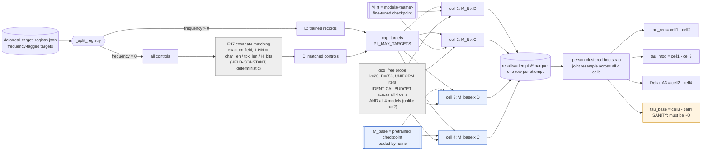
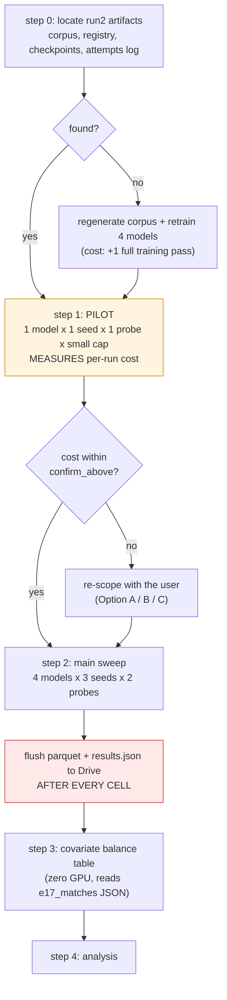

# Preregistration — convergent_validity_20260902

_Convergent-validity check on the calibrated memorization signal, via the model-side route (E2).
Type: `experiment`._

_Superseded framing: an earlier draft paired E2 with a frequency dose-response arm (E5); E5 was
dropped before compute — see `## Question`. Type: `experiment`.
Status: in design._

> Written section by section during the design stage; each confirmed section replaces one
> `_pending_` marker. Preregistration exists because once results are visible, every human being
> alive — including the author — will find a story that fits them. Fixing the hypothesis, the metric,
> and the test beforehand costs nothing now and cannot be done afterwards.

## Question

E1 has already produced direct estimates of the two quantities this paper turns on: the forcing
floor `α_k = EMR(C)` and the calibrated signal `τ̂rec = EMR(D) − EMR(C)`. Both come from a single
route — hold the model fixed, vary whether the record was in the corpus.

**Does a second route, holding the records fixed and varying the model instead, reproduce the same
calibrated signal — and does the assumption that route depends on actually hold?**

| Route | Holds fixed | Varies | Estimates |
|---|---|---|---|
| **E1** (baseline, already run) | model `M_ft`, attack | the record's **membership** | `α_k`, `τ̂rec` |
| **E2** (this study) | the records, attack | the **model** (`M_ft` vs `M_base`) | `τ̂mod = EMR(D) − EMR_base(D)` |

The two rest on **different assumptions**, which is what makes agreement informative:

| Estimator | Depends on | Fails when |
|---|---|---|
| `τ̂rec` | **A1 exchangeability** — C is comparable to D in forcibility | C is harder to force ⇒ `τ̂rec` overstated |
| `τ̂mod` | **A3 domain monotonicity** — fine-tuning does not lower an excluded record's elicitability | fine-tuning lowers general forcibility ⇒ `τ̂mod` overstated |

**Population**: SSN and email targets on four self-fine-tuned models (GPT-2 124M/355M,
Pythia 1.4B/2.8B), one controlled synthetic corpus, seed(s) per the protocol.

### Why E5 is not in this study

A frequency dose-response arm (E5) was designed and removed before any compute was spent. Two
reasons, both fatal at the current corpus scale:

1. **The dose curve cannot be validated.** The corpus has three trained frequency tiers (1/5/20).
   Three points against a two-parameter curve leaves one degree of freedom, so the functional form
   cannot be tested — and extrapolating *outside* the observed range to f=0 depends entirely on that
   untested form.
2. **The tier that matters most is the smallest.** f=1 holds 10 individuals (20 targets). A direct
   f=20 versus f=1 contrast has a minimum detectable effect of roughly **47 percentage points** under
   person-clustered inference. An effect that large would already be visible in E1's single `τ̂rec`.

A third, more basic objection: "a trained record that appeared zero times" *is* a control record, so
comparing the extrapolated intercept against the control arm is close to tautological. The one thing
it could genuinely detect — controls not being exchangeable with trained records — has a direct and
**free** test: the covariate balance table required by Algorithm 1 step 2, computable from the
already-persisted `results/e17_matches_*.json`. That table is included in this study instead.

E5 becomes worthwhile only after the corpus is regenerated with balanced frequency tiers, which
requires retraining every model.

## Hypotheses

### H1 — the sandwich is consistent and the audit is valid

| | |
|---|---|
| **H0** | `τ̂rec` and `τ̂mod` estimate different quantities |
| **Direction** | `τ̂rec ≤ τ̂mod` (Proposition 4) |
| **Metric** | Both point estimates with 95% person-clustered bootstrap CIs, per model |
| **Refuted by** | `τ̂rec > τ̂mod` beyond their intervals |

This is Proposition 4's own falsification test. A reversed inequality means A1 or A3 has failed and
**the audit is invalid** — a result the paper's framework predicts is possible but has never checked.
Agreement pins `τ` and yields the interval `[τ̂rec, τ̂mod]`.

### H2 — A3 holds: fine-tuning does not reduce general forcibility

| | |
|---|---|
| **H0** | `EMR(C) = EMR_base(C)` |
| **Direction** | `EMR(C) ≥ EMR_base(C)` |
| **Metric** | Control-arm extraction rate on the fine-tuned model versus the base model, same records, same attack |
| **Refuted by** | `EMR(C) < EMR_base(C)` beyond the intervals |

Both arms here are records **neither model ever saw**, so any difference is attributable to what
fine-tuning did to the model's general forcibility — exactly the quantity A3 asserts about. **E2
therefore tests the assumption its own estimator depends on**, which `τ̂rec` cannot do for A1.

Refuting H2 means `τ̂mod` cannot serve as the upper bound in Proposition 4, and the sandwich collapses
to a single estimator.

### Sanity condition — the base model must show no signal

On the base model **both arms are never-trained**: it saw neither D nor C. The calibrated signal
there is therefore zero by construction:

```
τ̂_base = EMR_base(D) − EMR_base(C) ≈ 0
```

A significantly non-zero `τ̂_base` means the harness or E17's covariate matching is broken, and the
main results cannot be trusted. This is checked **before** H1 and H2 are read, and a failure blocks
the study rather than being reported as a finding.

## Prediction

_Recorded before any run. Its value lies precisely in being falsifiable after the fact._

### The researcher's prior

- **H1: the sandwich holds and the two estimators are close.** `τ̂rec ≤ τ̂mod` with a narrow bracket,
  i.e. the calibration method is validated and both routes agree.
- **H2: A3 holds, and in the strong direction** — `EMR(C) > EMR_base(C)`. Fine-tuning makes the model
  *more* forcible in general, plausibly because it has learned the surface form of the PII documents
  (labels, separators, the nine templates) even for records it never saw.

### The designer's estimate (for post-hoc comparison only; not the researcher's position)

| Quantity | Estimate | Basis |
|---|---|---|
| `EMR_base(C)` | Well below `EMR(C)`'s 39% | The base model has never seen the corpus's document formats; forcing a labelled SSN out of it should be harder |
| `EMR_base(D)` | Close to `EMR_base(C)` | The base saw neither arm, so both are pure forcing |
| `τ̂_base` | ≈ 0, CI containing 0 | Sanity condition; non-zero would indicate a broken harness |
| `τ̂mod` | Larger than `τ̂rec` | `τ̂mod = EMR(D) − EMR_base(D)`; if `EMR_base(D)` is well below `EMR(C)`, the gap is wider |
| H1 verdict | Holds, but with a **wide** bracket | Follows from the above — the two estimators agree in ordering but not in magnitude |

### Where the two differ

The researcher expects `τ̂rec` and `τ̂mod` to be **close**; the designer expects the same ordering but
a **wide** gap. The width of `[τ̂rec, τ̂mod]` is therefore the sharpest point of disagreement recorded
here, and it is exactly what Proposition 4 calls the interval estimate of `τ`. A narrow bracket is a
much stronger result for the paper than a wide one.

## What the Answer Changes

**The core: this is the first execution of Proposition 4's falsification test.** The paper proves the
sandwich theorem, marks `τ̂mod` as unmeasured (◦) in Table 2, and reports only the horizontal cut. A
theorem that has never been run against data is an assertion about what would happen, not a result.

| Outcome | Effect on the paper |
|---|---|
| **H1 supported, narrow bracket** | `τ̂mod` moves from ◦ to ✓ in Table 2; Proposition 4 gains an interval estimate of `τ`; the calibration is validated by a route that does not use the control records at all |
| **H1 supported, wide bracket** | Same, but the interval is weak evidence. Worth reporting honestly — a wide sandwich still bounds `τ` |
| **H1 refuted** (`τ̂rec > τ̂mod`) | **A1 or A3 has failed and the audit is invalid.** This would be the single most consequential negative result available to this project: it would say the paper's own calibrated numbers cannot be trusted until the failing assumption is identified and fixed |
| **H2 supported** | A3 holds; `τ̂mod` is a legitimate upper bound; and there is a concrete mechanism to report — fine-tuning raises general forcibility, which is itself a finding about what fine-tuning does |
| **H2 refuted** | `τ̂mod` cannot serve as the upper bound; the sandwich collapses to one estimator and Proposition 4 becomes inapplicable to this setting |
| **Sanity fails** (`τ̂_base` ≠ 0) | The harness or the covariate matching is broken. **Blocks the study** and casts doubt on E1's already-published numbers, since they share the same matching code |

**What the next study depends on**: if A3 holds and the bracket is narrow, the full 2×2 design is
validated and the capacity sweep (the abandoned `capacity_response_20260831`) can be revived on firm
ground. If the sanity condition fails, nothing else in the project proceeds until it is fixed.

## Variables

### Independent (manipulated)

| Variable | Levels | Note |
|---|---|---|
| **Model state** | `finetuned` / `base` | The new axis. `base` = the original pretrained checkpoint, loaded by name (`_load_model(..., state="base")`), so it genuinely never saw the corpus |
| **Membership** | `trained` (D) / `control` (C) | The E1 axis, retained so the design is fully crossed |

### Dependent (measured)

| Variable | Definition |
|---|---|
| `EMR` | Exact-match rate: fraction of (person, field) targets the probe forces the model to emit verbatim, under an identical budget and decision rule in every cell |
| `forward_passes` | Query cost per target; the budget-equality witness |
| `success_step` | GCG step at which the check first passed (right-censored at 200) |

### Controlled (held constant across all four cells)

Attack (`gcg_free`, k=20, B=256 candidates, 512 sampled evaluations) · decision rule (greedy
generate, `T+20` tokens, `exact_match`) · target registry and the E17-matched control set · fields
(SSN, email) · seeds · **`PII_GCG_ITERS`** · **`PII_MAX_TARGETS`**.

**Budget equality across cells is the load-bearing control.** The paper's central invariant is that D
and C receive an identical budget; this study extends it to the model axis. A cheaper attack on the
base model would manufacture `τ̂mod` out of nothing.

### The uniform-budget commitment (a correction to run2)

run2 did **not** hold the budget constant. `slurm/submit_per_model.sh` and `CODE_MAP.md` §3 record
per-model values:

| Model | run2 `PII_MAX_TARGETS` | run2 `PII_GCG_ITERS` |
|---|---|---|
| gpt2 124M | 25 | 200 |
| gpt2-medium 355M | 12 | 120 |
| pythia-1.4b | 20 | 150 |
| pythia-2.8b | 12 | 120 |

`CODE_MAP.md` states the consequence outright: **"τ̂ is not comparable across models."**

This study therefore commits to a **single uniform configuration across all four models and all four
cells** — one `PII_GCG_ITERS`, one `PII_MAX_TARGETS`, for both rows of the 2 x 2. Two consequences,
both accepted deliberately:

1. **The top row must be re-run.** Reusing run2's numbers against a fresh uniform bottom row would
   give the base model *more* optimization budget than the fine-tuned model for three of four
   models — exactly the failure the Threats table calls fatal. This makes the E1 re-run
   unconditional, not contingent on the target cap.
2. **It repairs a defect the paper already carries.** Cross-model comparability is restored as a side
   effect, which is worth more to the revision than the compute it costs.

The uniform step count is set at the protocol stage from the measured pilot; it is **not** assumed to
be 200. Whatever value is chosen is identical everywhere.

### Uncontrolled but recorded

GPU model (Colab varies per session) · wall-clock and accelerator-hours · queue and preemption events · `pip freeze` hash (the environment is not pinned — see Threats) · driver/CUDA version.

## Arms

A **fully crossed 2 x 2**. The top row already exists from E1's run2; the bottom row is what this
study runs.

|  | **D** (trained records) | **C** (E17-matched controls) |
|---|---|---|
| **`M_ft`** (fine-tuned) | `EMR(D)` — *existing (E1)* | `EMR(C)` = the forcing floor `α_k` — *existing (E1)* |
| **`M_base`** (pretrained) | `EMR_base(D)` — **new** | `EMR_base(C)` — **new** |

Every contrast the study needs is an edge of this square:

| Contrast | Name | Reads as |
|---|---|---|
| Top row | `τ̂rec` | Calibrated signal (E1's headline) |
| Left column | `τ̂mod` | Model-side estimator (Prop. 4 upper bound) |
| Right column | `Δ_A3 = EMR(C) − EMR_base(C)` | What fine-tuning did to general forcibility |
| Bottom row | `τ̂_base` | **Sanity: must be ≈ 0** |

### Sanity-check condition

The bottom row is the required known-in-advance condition. On `M_base` **both arms are
never-trained records**, so `τ̂_base = 0` by construction. A significantly non-zero value means the
harness or E17's matching is broken, and it is read **before** any other contrast.

### Why no additional control arm is needed

The usual objection — "the base model might just be worse at everything" — is answered by the square
itself rather than by a new arm: `EMR_base(C)` is exactly the base model's general forcibility, and
it is already a cell.

## Experiment Pipeline



Blue = the new cells this study runs. Grey = held constant. Amber = the sanity gate.

**The confound this diagram is drawn to expose**: the only thing that differs between cell 1 and
cell 3 is the model's weights. Registry, matching, capping, probe, budget, decision rule, and seed
all flow through the identical path. If any of them were re-derived per model — in particular if E17
matching depended on the target model — `τ̂mod` would not be a clean model contrast. It does not:
E17's features are computed under a fixed held-out reference model, so the matched control set is
**identical across all four cells**.

## Data

### Provenance

| Component | Source | Reproducible? |
|---|---|---|
| Fictitious individuals + PII | Faker, `Faker.seed(data_cfg.seed)` | **Yes**, deterministic |
| Negative controls | Faker, `seed + 1000` | **Yes**, deterministic |
| PII documents | Nine templates, `random.Random(data_cfg.seed)` | **Yes**, deterministic |
| Public passages — Wikipedia | `wikimedia/wikipedia`, config **`20231101.en`** | **Yes**, snapshot-pinned by the dated config |
| Public passages — arXiv | `ccdv/arxiv-summarization`, undated | **No** — the real drift risk |
| Public passages — **C4 fallback** | `allenai/c4`, activates only if the first two under-deliver | **No**, and see the stop condition below |

**Correction**: an earlier draft of this section (and `agenda.md`) said "Wikipedia / PG-19 / arXiv".
**PG-19 appears nowhere in `data_generation.py`.** `config.py`'s `public_sources =
["gutenberg", "wikipedia", "arxiv"]` is **dead config** — `fetch_public_passages` never reads it (the
same defect pattern as `template_types`, `CODE_MAP.md` #9). The real chain is Wikipedia → arXiv →
C4.

> **C4 is a stop condition, not a caveat.** C4 is Common-Crawl-derived and contains unfiltered real
> names, emails, and phone numbers scraped from the open web. If the Wikipedia stream under-delivers
> — a live risk, since it needs that HF revision resolvable over the network at generation time — the
> C4 fallback activates and **real incidental PII enters the training corpus as filler**, which
> contradicts this study's "no real personal data" claim outright. Before every run, check
> `data/corpus_metadata.json`'s source breakdown and **halt if C4 contributed anything**.

### Contamination posture (stated explicitly for the record)

Assessed and **clean**, but the reasoning must be in the paper because a non-zero `EMR_base` will
otherwise be misread:

- **SSN**: Faker's `en_US` provider spans area ∈ [1,899]\{666}, group ∈ [1,99], serial ∈ [1,9999] ≈
  **8.9 x 10⁸** values. Against ~150 draws, collision with any real SSN-shaped string in a
  pretraining corpus is ~10⁻⁵.
- **Email**: `fake.email()` is called with no arguments, so `safe=True` applies and the domain is
  forced to IANA-reserved `example.com/.org/.net`. It **cannot** collide with a real address.
- **The framing that matters**: a non-zero `EMR_base(D)` or `EMR_base(C)` is **not evidence of
  contamination**. It is this paper's own central phenomenon — GCG forcing an arbitrary string out of
  a model that never saw it, which is what the 39% forcing floor already demonstrates. And because D
  and C are generated by structurally identical Faker calls differing only in a seed offset, any
  residual contamination is **symmetric across the two arms** and does not bias `τ̂_base`.
- **Unverified, so assert it**: `generate_individuals(100, seed)` and `generate_individuals(50,
  seed+1000)` have **no runtime disjointness check** (`CODE_MAP.md` #14). Collision is improbable
  (~10⁻⁵), not impossible, and one collision would silently move a control record's true membership
  to "trained" and inflate `α_k`. Add a one-line assertion over SSNs and emails at corpus-build time.

**Ethics**: non-human-subjects research; all target PII is Faker-generated; **no IRB required**.
`use_real_pii` defaults to `False` and is not overridden for this study.

### Splits and the grouping unit

There is no train/test split in the usual sense; the split that matters is **D versus C**. The
code's actual predicate is the registry's `is_negative_control` boolean, not `frequency > 0`; the two
coincide only because `_scale_frequency_groups` always assigns frequencies from {1, 5, 20} and never
0. The "control hiding in the trained arm at frequency 0" path **does not exist** under the current
config. The **grouping unit is `person_id`** — one individual
contributes up to two targets (SSN, email), and those two are not independent. Every interval in this
study resamples persons, never targets.

### The E17 matched control set

Controls are not the whole control pool: `_matched_control_entries` keeps only those E17 selects, so
C is exchangeable with D on `char_len`, `tok_len`, and `H_bits` (exact match on `field`).
Two properties, both verified in the code and both consequential:

1. **Matching is deterministic.** It uses no RNG; the `seed` argument only names the output file.
   The matched set is therefore identical across seeds *and* across the four cells — good for the
   contrast, but it means **control-selection variance is not captured by re-seeding** (see Threats).
2. **Matching is with replacement.** One control can be matched to several trained records, and
   `_matched_control_entries` de-duplicates by person, so `|C| ≤ |D|`.

#### The control arm is hard-capped at 50, and the power table assumed otherwise

`config.py`: `n_individuals = 100`, `n_negative_controls = **50**`. Two consequences:

- **`PII_MAX_TARGETS = 100` does no capping at all.** `cap_targets` returns unfiltered when
  `n >= len(targets)`, and the trained pool is exactly 100. So run2's target set *is* a strict subset
  of the cap=100 set — but only by that coincidence. The stride `round(i·(L−1)/(n−1))` does **not**
  nest across different `n` in general (L=10: n=3 → {0,4,9}; n=5 → {0,2,4,7,9}), so this must never be
  generalized to another corpus size.
- **`|C| ≤ 50` regardless of the cap.** The power table's 100- and 200-person rows are **unachievable
  on the control side** with the current corpus.

**The fix is free.** Negative controls never enter the training corpus — `corpus = pii_docs +
public`, and `neg_controls` are appended only to `target_registry` (`data_generation.py:842-861`). So
raising `n_negative_controls` via `PII_N_CONTROLS` **requires no retraining whatsoever**. Regenerate
the control pool to **150** before the sweep: it balances the arms at 100 each and leaves headroom for
the 2nd-nearest-neighbour sensitivity check.

### The covariate balance table (Algorithm 1, step 2 — zero compute)

`results/e17_matches_<run>_seed<seed>.json` already persists `char_len`, `tok_len`, and `H_bits` for
**both** sides of every matched pair. Algorithm 1 step 2 requires the auditor to report D-vs-C
overlap on these covariates and abort if it fails; the paper has never reported it.

**The paper's four covariates and the code's are the same four** — Algorithm 1 step 1 says matched on
"field type, length, tokenization, and entropy", and the code matches exactly on `field` and 1-NN on
`char_len` / `tok_len` / `H_bits`. This is **not** one of the paper/code mismatches.

**Two SMDs are reported, not one, because the obvious one is nearly tautological.** Each control was
selected *specifically* to minimize distance to its partner, so an SMD over matched **pairs** mostly
re-measures that the nearest neighbour was near — it can barely fail:

| SMD variant | What it tests | Can it fail? |
|---|---|---|
| Over matched **pairs** (the persisted payload's structure) | "the closest available control was close" | Barely — near-tautological |
| Over the **deduplicated control set's marginal** vs D's marginal | "the control pool is representative of D's population" | **Yes — this is the real test of A1** |

Both are reported per field against |SMD| < 0.1. Both cost **no GPU time**, only a read of
`results/e17_matches_<run>_seed<seed>.json`, which already persists `char_len`, `tok_len`, `H_bits`
for both sides of every pair.

> **Blocking dependency**: `data/`, `models/`, and `results/` are all empty on the local machine.
> The corpus, the registry, the four fine-tuned checkpoints, and run2's attempt log live on Google
> Drive / Cheaha. Every number in the top row of the 2 x 2 comes from that log. **Locating it is the
> first protocol step**; if it is unrecoverable, the top row must be re-run, which requires the
> checkpoints, which requires the corpus. See Open Questions.

## Analysis Plan

### The identity that organizes the whole study

The four cell means are four numbers, so the four contrasts are not independent. Writing them out:

```
tau_rec   = EMR(D)      - EMR(C)
tau_mod   = EMR(D)      - EMR_base(D)
Delta_A3  = EMR(C)      - EMR_base(C)
tau_base  = EMR_base(D) - EMR_base(C)
```

gives, exactly and by construction:

```
tau_mod = tau_rec + Delta_A3 - tau_base
```

**Consequence 1.** Exactly, `τ̂mod − τ̂rec = Δ_A3 − τ̂_base`. The sanity gate does not make `τ̂_base`
*zero* — it only fails loudly when `τ̂_base` is detectably non-zero — so the clean reading

```
tau_mod - tau_rec  ~=  Delta_A3          (approximately; exactly, minus tau_base)
```

is an **approximation whose error is `τ̂_base`**, and `τ̂_base` is bounded only by the gate's 24 pp
detection threshold, not by 0. The confirmatory quantity is therefore `Δ_A3` itself — which the
two-block bootstrap estimates directly — and `τ̂_base` is carried as a reported correction term, not
silently assumed away.

So H1 and H2 are not two independent questions — **H1 holds if and only if H2 holds**, given the
sanity condition. That is a feature, not a redundancy: it means the sandwich's *width* has a
mechanistic interpretation ("how much more forcible fine-tuning made the model in general") rather
than being an unexplained interval.

**Consequence 2 — the recorded predictions are in tension.** The researcher predicted H1 with the two
estimators **close**, and H2 in the **strong** direction (`EMR(C) > EMR_base(C)`). The identity says
those cannot both be strongly true: a large `Δ_A3` *is* a wide bracket. Whichever way the data falls,
one of the two predictions gives ground — which is exactly what makes recording them worthwhile.

### Estimator and intervals

- **Estimator**: cell means are unweighted target-level exact-match rates; contrasts are differences
  of cell means.
- **Intervals**: person-clustered bootstrap, resampling unit `person_id`, **N = 10000**, seed
  `20240601` — the convention in `reporting.md`.

#### The joint bootstrap is TWO-BLOCK, and it does not exist yet

The four cells do not share one person pool. D-persons and C-persons are **disjoint individuals**;
the `M_ft` / `M_base` axis is **paired on the same persons**. So the contrasts split into two kinds:

| Contrast | Structure | Correct resampling |
|---|---|---|
| `τ̂rec`, `τ̂_base` | disjoint persons (D vs C) | two independent draws |
| `τ̂mod`, `Δ_A3` | **same persons, two models** | paired — one draw, both columns |

Per replicate:

1. Draw one index over **D-persons** (size \|D\|, with replacement); apply it to **both** cell 1 and
   cell 3.
2. Draw one **independent** index over **C-persons** (size \|C\|, with replacement); apply it to
   **both** cell 2 and cell 4.
3. Compute all four cell means, then all four contrasts, from those two draws.

This keeps the identity exact inside every replicate and gives a valid joint distribution for
`τ̂mod − τ̂rec`.

> **This is new code.** `_cluster_diff_ci` (`make_tables.py:138`) resamples its two arms
> *independently* — its own docstring says so — which is right for `τ̂rec`/`τ̂_base` and **wrong** for
> `τ̂mod`/`Δ_A3`: it has no notion of "same person, different model-state column", so it cannot
> compute the paired contrasts at all. Treating those as independent would ignore the positive
> within-target correlation across models and break the per-replicate identity. Writing the two-block
> bootstrap is a **protocol deliverable with unit tests**, not an existing capability.

#### Degenerate arms — three cases, and no implementation exists

`grep -i "newcombe\|wilson" make_tables.py` returns **nothing**. The convention in `reporting.md` has
never been implemented; the draft's existing Newcombe intervals were computed by hand, which is where
two of its inconsistencies came from. Preregistering "switch to Newcombe" without the function is
repeating that mistake, so the switch rule is specified in full here and implemented before any table
is generated:

| What is degenerate | Method |
|---|---|
| A single cell, 0/n (run2 already has one: Pythia-2.8B `EMR(C)` = 0/12) | Wilson score interval |
| An **independent** contrast touching it (`τ̂rec`, `τ̂_base`) | Newcombe hybrid / MOVER on two Wilson intervals |
| A **paired** contrast touching it (`τ̂mod`, `Δ_A3`) | Exact/score interval for matched binary data |

Every row using any of the three is marked in the table note. **Protocol deliverable**: implement and
unit-test all three against published worked examples before use.

### Tests

| Hypothesis | Test |
|---|---|
| **Sanity `τ̂_base`** | **Detection check** (not equivalence — see below): does the 95% CI *exclude* 0? If it does, the study is blocked. Read **first** |
| H1 `τ̂rec ≤ τ̂mod` | One-sided: does the CI for `τ̂mod − τ̂rec` exclude 0 from below? |
| H2 `EMR(C) ≥ EMR_base(C)` | Same event as H1 by the identity; reported as a derived interpretation, **not** a second family member |
| Balance (A1) | Standardized mean difference per covariate per field; balance threshold \|SMD\| < 0.1 |

#### The sanity gate is a detection check, not an equivalence test

An earlier draft specified "is the 95% CI contained in ±5 pp". **That gate is unreachable and was
removed.** `τ̂_base` is a disjoint-person contrast, so its 95% half-width is
`1.96 · sqrt(0.375 / n_persons)` at worst-case p:

| Persons/arm | Half-width | | Persons/arm | Half-width |
|---|---|---|---|---|
| 25 | 24.0 pp | | 200 | 8.5 pp |
| 100 | **12.0 pp** | | **577** | **5.0 pp** |

Reaching ±5 pp needs ~**577 persons per arm** — five times the largest configuration considered, and
nearly triple the entire registry. A gate that reads "cannot demonstrate equivalence" no matter what
the data say is not a gate.

What the gate is actually for is catching a **broken harness** — control records leaking into the
trained arm, E17 matching silently returning the wrong set, a shard-tag collision mixing model
states. Those failures produce effects on the order of `τ̂rec` itself (tens of pp), not 5 pp. So the
gate is: **does `τ̂_base`'s CI exclude 0?** If yes, something is wrong and the study stops.

**Stated honestly**: this gate has power only against gross breakage (MDE 24 pp at 100 persons/arm).
It cannot certify that `τ̂_base` is *small*, and the write-up must say so rather than reporting a pass
as evidence of correctness. The achieved half-width is reported next to the estimate every time.

**Multiple comparisons**: because the identity makes H1 and H2 the same event, the confirmatory
family is **`Δ_A3` (equivalently `τ̂mod − τ̂rec`) x {4 models} = 4 tests**, Holm-corrected — not 8.
Counting the near-duplicate would have spent per-test α for nothing in a design that is already
tight. H1's own ordering and CI are reported as a diagnostic alongside each. The primary model is
prespecified as **GPT-2 124M** (smallest, so the most targets per accelerator-hour); the other three
are supporting evidence with corrected intervals.

### Power — read this before approving the budget

Approximate two-sided MDE at 80% power, α = 0.05, worst-case p = 0.5, with a design effect of 1.5
(two targets per person, ICC ≈ 0.5):

| Persons per arm | **Independent** contrasts `τ̂rec`, `τ̂_base` | **Paired** contrasts `τ̂mod`, `Δ_A3`, discordance 0.2 / 0.4 |
|---|---|---|
| 12 *(run2, Pythia-2.8B & GPT-2-M)* | **49.5 pp** | 31.5 / 44.5 pp |
| 25 *(run2, GPT-2 124M)* | **34.3 pp** | 21.7 / 30.7 pp |
| 50 | 24.3 pp | 15.3 / 21.7 pp |
| 100 | 17.2 pp | 10.9 / 15.3 pp |
| 200 *(full registry)* | 12.1 pp | 7.7 / 10.9 pp |

**Column assignment corrected.** An earlier draft put `Δ_A3` in the independent column. It is not:
`Δ_A3 = EMR(C) − EMR_base(C)` is the **right column of the 2 x 2** — the same C-persons under two
models — so it is paired, exactly like `τ̂mod`. Since H2 is tested on `Δ_A3`, and `Δ_A3` is the
confirmatory family, this is the column that matters, and it is the *more* favourable one. The two
paired contrasts may have **different discordance rates** (`π_d` on the D-arm need not equal `π_d` on
the C-arm), so they are estimated separately, not assumed equal.

**At run2's target count this design can only detect very large effects.** That is a design problem,
not a caveat to be written up afterwards, and it drives the budget decision below.

> **`ICC = 0.5` (hence `DEFF = 1.5`) and `π_d` are assumed, not measured — and run2 already contains
> the data to measure them.** run2's attempt log holds per-person, per-field outcomes for D and C on
> four models: the within-person SSN/email correlation gives the ICC directly, and `M_ft`-vs-`M_base`
> agreement gives `π_d` once the bottom row exists. Since these two numbers set the achievable
> half-widths this whole section argues from, estimating them is a **required protocol step before
> the budget option is finalized**, at zero GPU cost — the same free-check logic as the covariate
> balance table. It is gated on recovering the run2 log (Open Question 1).

The composite of a McNemar-type paired MDE with a clustering design effect is a heuristic, not a
derivation — the two variance sources are not obviously separable. Once the two-block bootstrap
exists it should be validated by direct simulation (generate synthetic replicates under assumed
parameters, run the actual CI procedure, measure empirical power) rather than trusted in closed
form.

### The budget decision this forces

Cost scales as `targets x seeds x models x probes`. Three ways to spend the same compute, relative to
one run2-scale E1 pass (25 persons/arm, 1 seed, 4 models, 8 probes):

| Option | Config | MDE (paired, π_d=0.4) |
|---|---|---|
| **A — mirror run2** | 25 persons, 1 seed, 4 models, 8 probes | 30.7 pp |
| **B — trade probes for targets** *(recommended)* | 100 persons, 3 seeds, 4 models, **3 probes** | **15.3 pp** |
| **C — seeds only** | 25 persons, 3 seeds, 4 models, 8 probes | 30.7 pp |

**Option B is recommended and C is rejected.** Person-level variance is the dominant term, and extra
seeds do not reduce it — they re-draw GCG's candidate sampling within a fixed set of people. Option C
triples the cost and moves the MDE hardly at all. The eight-probe capacity axis is E1's and E3's job;
this study needs endpoints, not the whole sweep.

> **The "seeds change nothing" claim is softened deliberately.** It is not exactly zero: under
> `_person_groups` a person's cluster vector holds one 0/1 entry per (field x seed) attempt, so more
> seeds per person reduce the noise in each person's cluster mean, which propagates as a
> **second-order** effect into the person-cluster bootstrap SE. The claim is that this is small
> relative to the between-person term — plausible from first principles, **not yet measured**. The
> variance-components estimate required above settles it, and it is the deciding argument for a 3x
> allocation, so it should not rest on assertion.

Option B satisfies the agenda's seed floor of 3, so no seed is being cut to buy targets.

**Both rows are budgeted.** The uniform-budget commitment makes the E1 re-run unconditional, so
Option B's cost covers `M_ft` and `M_base` alike — the 2 x 2 is run whole, at one configuration.

> **Absolute cost is not yet known.** No run has ever been measured, so the relative multipliers
> above are the only honest currency. Converting them to accelerator-hours, and confirming Option B
> fits the ~20-day window before the **2026-09-24** experiment deadline, is the pilot's job. If it
> does not fit, targets are cut before seeds are.

### Reporting

Every cell reported as `(rate, floor)` with n; every contrast with a 95% CI and its n; the
covariate-balance table alongside. Every number in this study carries the exploratory mark `ᵉ` until
it reaches 3 seeds.

## Baselines & Prior Art

### The baselines are internal, and they are already specified

This study makes no claim of the form "our method beats theirs", so the relevant baselines are
**within-study reference conditions**, all of which are cells of the 2 x 2:

| Baseline | Role |
|---|---|
| `fixed` probe (zero-capacity) | The natural-prompt lower endpoint. Without it, a low `EMR_base` cannot be distinguished from "the base model emits nothing useful at all" |
| `random_restart` probe (non-gradient) | **Disambiguates the mechanism** — see below |
| `EMR_base(C)` | General forcibility of the untrained model — answers "the base model is just worse at everything" without a new arm |
| `τ̂_base` | The known-answer sanity condition |

`fixed` is the trivial baseline the design would otherwise be missing, which is why Option B keeps
more than one probe.

#### Why `random_restart` is kept, at the cost of a third probe

H2's recorded prediction commits to a **mechanism**: fine-tuning raises `EMR(C)` "plausibly because
it has learned the surface form of the PII documents ... even for records it never saw." But
`gcg_free` is gradient-guided, and gradient search can behave differently against a fine-tuned loss
landscape than a pretrained one **for reasons unrelated to content** — sharper, more informative
gradients after fine-tuning, whatever the fine-tuning was on. A positive `Δ_A3` measured only with
`gcg_free` is therefore consistent with two stories: content-shaped forcibility, or an optimizer
artifact.

`random_restart` uses no gradients. If `Δ_A3` survives on it, the optimizer-artifact story is ruled
out; if it vanishes, the mechanistic claim in `## Prediction` must be withdrawn. It is run
**non-confirmatory** — not in the Holm family, reported as an interpretability check — and it is
cheap relative to `gcg_free` (512 generations against 200 x 512 batched forwards).

> **Caveat that must be stated wherever it is reported**: despite its role, `random_restart` is
> **not** budget-matched in the current code. `n_random_restarts = 512` against `gcg_free`'s ~61,440
> forward passes is a ~120x gap — a mismatch already logged in `CODE_MAP.md`. It is a *qualitative*
> mechanism check, not an equal-budget control, and calling it the latter would repeat the paper's
> own error.

The final probe set is therefore **`gcg_free`, `fixed`, `random_restart`**.

### Prior art this study sits against

- **Proposition 4 (this paper)** is the direct antecedent: it proves the sandwich and marks `τ̂mod`
  as unmeasured (◦) in Table 2. This study supplies the missing measurement. The novelty claim is
  therefore modest and checkable — *first empirical execution of our own Proposition 4* — not a claim
  about the literature.
- **Counterfactual memorization** — comparing the same example under a model trained with it against
  one trained without it — is the closest structural antecedent to `τ̂mod`, and closer than the
  generic causal-inference framing. Cite it where the model-swap is introduced.
- **Shadow-model / likelihood-ratio MIA calibration** (LiRA-style) compares a target model against
  reference models that never saw the example. That is mechanically what the base-model arm does,
  and a SaTML reviewer working this subfield will expect it cited.
- **Placebo / negative-control designs** in causal inference are the general template; the framing as
  a placebo cell is stated in `experiments.py`'s own docstring for E2. Correct but generic — it is
  the altitude, not the antecedent.
- **Membership-inference calibration** work motivates `τ̂rec` as a distinguisher advantage. This study
  does not extend that literature; it validates one estimator against another within a fixed setup.

Citing the two closer antecedents does **not** weaken the novelty claim, which stays exactly as
scoped: *first empirical execution of our own Proposition 4*, not a new finding about the
literature.

### What would make the claim illegitimate

Comparing `EMR_base` to any **published** extraction rate from another paper. Different corpus,
different budget, different decision rule — the whole point of the paper is that such rates are not
comparable without a floor. All comparisons here are internal, at matched budget, on the same
records.

## Reproducibility & Execution

### The five pins

**Nothing currently records four of the five pins.** The only per-run artifact this pipeline writes
is the 27-column parquet from `attempt_log.py`, carrying `run_id` / `exp_id` / `seed` / `model_name`
/ `model_state` — and nothing else. Verified by grep: **no `git`, no `sha`, no `commit`, no
`pip freeze`, no config dump** anywhere in `experiments.py`, `config.py`, `attempt_log.py`, or
`slurm/`. The `results.json` that `compute.md` and `reporting.md` refer to is written only by
`run_experiments.py` / `defense_eval.py` — **legacy pipeline A**, which `CODE_MAP.md` forbids for
this paper's numbers.

| Pin | Recorded today | Required action |
|---|---|---|
| **Code** | **No** | Capture `git rev-parse HEAD` + `git status --porcelain` (dirty flag) |
| **Config** | Only `seed` / `model` / `state` | Dump the fully-resolved config: `PII_PROBES`, `PII_MAX_TARGETS`, **`PII_GCG_ITERS`**, `PII_N_CONTROLS`, `PII_DEVICE_PROFILE`, resolved `HW`, GPU model |
| **Data** | **No** | Content-hash corpus + registry; **artifacts are not local** — see the blocking dependency |
| **Seed** | **Yes** (in the parquet) | — |
| **Environment** | **No** | `requirements.txt` is lower-bounds-only; add a `pip freeze` hash step to the launch script — it does not exist today |

> **`PII_GCG_ITERS` is the pin that broke run2, and it is not recoverable from the log**: `steps_run`
> records steps actually taken after early stop, not the configured ceiling `N`. On a target that
> succeeded early, `N` is simply gone.

**Protocol deliverable — the run manifest.** A small JSON written beside each parquet flush carrying
all of the above. Without it this table is aspiration, not description.

### Determinism

Only **partial**. `_membership_sweep` seeds `random` and `torch`, which covers GCG's candidate
sampling, but no CUDA determinism flags are set and the GPU model varies per Colab session.
Bit-identical re-runs are **not** claimed; the claim is that the reported intervals are wider than
the residual nondeterminism, which the repro check tests.

**Repro check — per-target flip rate, not interval containment.** An earlier draft said "confirm the
EMR agrees within the bootstrap CI". That is nearly a tautology: the CI is tens of points wide at
these n, so almost any re-run passes and the check catches nothing.

Instead: re-run one cell (GPT-2 124M, `M_base`, arm C, seed 0) in a second session, join the two
parquet shards on `person_id` + `field`, and report the **flip rate** — the fraction of individual
attempts whose binary `exact_match` differs between runs. Fail if the flip rate is not small relative
to `1 − EMR`. Same artifacts, no extra compute, and it tests residual nondeterminism directly.

### Execution



- **Environment**: Colab Pro as primary; `PII_DEVICE_PROFILE=auto` is **mandatory** (the assigned GPU
  differs per session and hardcoding `colab_pro` on a T4 will OOM). Cheaha `amperenodes-medium` for
  the two Pythia models if Colab sessions prove too short.
- **Preemption — the code flushes once, at the very end.** `AttemptLogger.flush()` is called a
  single time, at `experiments.py:819`, after every person, field, and probe of the whole
  `(model, model_state, seed)` sweep has finished; rows accumulate in a plain Python list until then.
  One such sweep spans **both** membership arms — two of the square's four cells. On Colab a
  preemption at any point before the last row destroys **100% of that shard's compute**, which at
  Option B's scale is many accelerator-hours per interruption.
  **Required code change before launch, not an assumed capability**: flush per person (or at minimum
  per membership arm), or switch to append-mode partial parquet writes. Retry cap 3 per cell, then
  escalate rather than looping.
- **`PII_DEVICE_PROFILE=auto` does not protect the attack.** `GCGConfig.effective_eval_batch` and
  `effective_minibatch` gate on the **literal string** `DEVICE_PROFILE == "colab_free"`, but
  `_auto_hw()` never sets that string — it returns a resource dict used for *training* batch sizes.
  On an auto-detected small GPU the candidate eval batch stays at the full 512/64 regardless of
  measured VRAM. **`auto` guards training, not GCG.** Fix: read the resolved `HW["gpu_mem_gb"]`
  instead of the profile string. This is the concrete mechanism behind "Pythia-2.8B does not belong
  on Colab".
- **Cost accounting**: `est_cost_usd = 0`; **accelerator-hours is the accounting unit**, and the GPU
  model is recorded on every run or the hours cannot be aggregated.
- **`confirm_above`**: currently a provisional 4 accelerator-hours. **The pilot's measured per-run
  cost replaces it before the main sweep launches** — that is the pilot's primary purpose.

### Compute estimate — derived bottom-up, and Option B does not comfortably fit

Per `gcg_free` iteration the code does **9 forward calls** (1 gradient forward/backward + 8 batch-64
candidate forwards scoring the 512 sampled candidates). At a uniform N=200 with no early stop that is
**1,800 forward calls per target** (102,400 candidate-sequence evaluations), plus ≤21 `generate()`
checks.

Worst-case time per target, at ~15% MFU on A100 and ~8% on T4, seq ≈30 tokens — **order-of-magnitude
only, unvalidated**:

| Model | A100-40/80G | T4-16G |
|---|---|---|
| gpt2 124M | ~16 s | ~2.5 min |
| gpt2-medium 355M | ~47 s | ~7 min |
| pythia-1.4b | ~3.1 min | ~28 min |
| pythia-2.8b | ~6.2 min | ~55 min |

Option B at uniform N=200, both rows: 4 models x 3 seeds x 2 states x 100/arm x 2 arms x 2 fields =
**9,600 `gcg_free` attacks**. Per model on A100: gpt2 ≈11 h, gpt2-medium ≈31 h, pythia-1.4b ≈123 h,
pythia-2.8b ≈**247 h** → **≈430 accelerator-hours worst case**, ≈260 h with an early-stop derate.

**The 20-day window is 480 wall-clock hours on one uninterrupted accelerator.** Even the optimistic
260 h leaves no slack for the pilot, the repro check, retries, queueing, or analysis. And
**pythia-2.8b alone exceeds Cheaha `amperenodes-medium`'s 48 h cap by ~5x**, needing ≥6 chained
`afterok` jobs whose queue time is unknown.

> **A 10x uncertainty band, openly stated.** run2's `submit_per_model.sh` requested up to **44 h**
> wall-clock for pythia-2.8B's entire E1 task, against ~4.4 h estimated here for the comparable work.
> Either that request carried large margin, or real per-attack cost is ~10x this estimate — plausible
> for uncompiled eager PyTorch. The honest range is **~250 h to 2,000+ h**, and only the pilot
> settles it. Note also that cost should be tracked in **GCG-attack count**, not probe count: of the
> eight probes only the three GCG-family ones and `softprompt` are expensive.

#### Option B′ — the fallback if the pilot lands high

Keep uniform N=200 and the probe set; keep 100/arm for the two GPT-2 models (~42 h combined) but drop
**both Pythia models to 40/arm** (~148 h) → **≈190 h worst case, ~46% of Option B**. The cost is real
and must be stated, not discounted: the paired MDE rises from **15.3 pp to ≈27 pp**.

### Artifacts

`results/attempts/*.parquet` (one row per attempt, the raw evidence) · `results/e17_matches_*.json`
(matching, and the balance table's input) · `results/tables/` (generated by `make_tables.py` only —
**no hand-transcribed numbers**, which is where two of the draft's existing inconsistencies came
from).

## Threats to Validity

### Internal

| Threat | Severity | Handling |
|---|---|---|
| **Tokenizer mismatch between `M_ft` and `M_base`** | Medium | Fine-tuning does not change the vocabulary for these four models, so the tokenizer is identical and targets tokenize identically. **Verify in the pilot** rather than assuming |
| **Budget not actually equal across cells** | High | Split into two checks. **(a) Configured budget**: `k`, `PII_GCG_ITERS`, `B`, `n_candidates_per_step` must be *identical* across all cells and all models — a hard equality on the config hash, and the fix for run2's per-model budgets. **(b) Realized `forward_passes`**: reported as a **descriptive diagnostic, not a gate**. `InstrumentedGCG` breaks on hit, so realized cost is a function of success rate; if `M_base` is harder to force it will legitimately burn more of the cap, and treating that as a violation would flag a correct run as broken |
| **Optimizer-landscape artifact** | High | A positive `Δ_A3` may reflect sharper post-fine-tuning gradients rather than learned document form. `random_restart` (gradient-free) is kept specifically to disambiguate; the mechanistic claim in `## Prediction` is withdrawn if `Δ_A3` does not survive on it |
| **LoRA vs full fine-tune confound** | Medium | GPT-2s are fully fine-tuned, Pythias use LoRA (a paper/code mismatch already logged in `CODE_MAP.md`). `Δ_A3` may differ in kind between the two families; analyze per model, never pooled |
| **Padding enters the loss unmasked** | Low here | A known defect affecting both cells identically, so it does not bias the contrast; it does affect absolute rates |

### External

- **Four models, one corpus, two fields.** Any claim generalizes to *these* fine-tunes, not to
  fine-tuning in general. The A3 result in particular is about what *this* fine-tuning recipe did.
- **Synthetic corpus.** Faker PII in nine templates is more regular than real documents, which
  plausibly inflates general forcibility on the fine-tuned model — i.e. may inflate `Δ_A3`.

### Construct

- **EMR is a substring/exact-match test on a greedy generation.** It measures "the optimizer forced
  this string out under this decision rule", not "the model retained the record". That gap is the
  paper's thesis and is not a defect of this study, but every sentence in the write-up must respect
  it.
- **A3 is asserted about elicitability in general; `Δ_A3` measures it on E17-matched controls only.**
  These coincide only if the matched controls are representative of the elicitability distribution.
  Stated as a limitation, not fixed.

### Conclusion

| Threat | Handling |
|---|---|
| **Underpowered at run2's target count** (MDE 34 pp independent / 30.7 pp paired) | **Addressed in the design**, not deferred: Option B raises targets to 100/arm, and the confirmatory contrast `Δ_A3` is the *paired* one (15.3 pp at π_d=0.4). If the budget forces Option A, the study reports the MDE alongside every null and makes no "no difference" claim |
| **The sanity gate cannot certify smallness** | It is a detection check with a 24 pp MDE at 100 persons/arm, not an equivalence test. A pass means "no gross breakage detected", never "the harness is correct", and the write-up says so with the achieved half-width attached |
| **ICC and π_d are assumed, not measured** | Every half-width in this design rests on `ICC = 0.5`. Estimating both from run2 is a required protocol step at zero GPU cost; if the realized ICC is materially higher, the budget option is re-decided before launch |
| **Multiplicity** | Family reduced to 4 (`Δ_A3` x 4 models) once the identity showed H1 and H2 are the same event; Holm within the family; primary model prespecified. `random_restart` results are non-confirmatory and outside the family |
| **Control-selection variance is invisible to seeding** | E17 matching is deterministic, so re-seeding does not perturb the control set. Every interval here conditions on one matched set. Sensitivity check: recompute with the 2nd-nearest neighbour and report whether conclusions move |
| **A shard lost to preemption is silently lost compute, not a wrong number** | `flush()` runs once per sweep, so an interrupted Colab session yields no rows at all rather than partial ones. It cannot corrupt results — it can only burn hours. Fixed by per-person flushing before launch |
| **C4 filler would put real PII in the corpus** | Halt condition checked against `data/corpus_metadata.json` before every run, not a caveat |
| **Environment not pinned** | `requirements.txt` uses lower bounds; a `pip freeze` hash is recorded, and "environment not pinned" is listed as a threat at analysis time |
| **Reading results before the sanity gate** | The gate is read first, by protocol. If `τ̂_base` is significantly non-zero the study is blocked, not reinterpreted |

## Success Criteria

**A refuted hypothesis satisfies every criterion below.** The study succeeds by producing a
trustworthy answer, not a favourable one.

1. **The sanity gate is read and reported** — `τ̂_base` with its CI, for every model, before any other
   contrast. Whether it passes or fails, it is in the write-up.
2. **All four cells are populated at one uniform configuration** — same `PII_GCG_ITERS`, same
   `PII_MAX_TARGETS`, every model, both rows — with the configured budget shown identical across
   cells and realized `forward_passes` reported as a diagnostic.
3. **`τ̂mod` gets a point estimate and a person-clustered CI** for every model, from the **two-block**
   joint bootstrap — enough to move it from ◦ to ✓ in Table 2 regardless of which direction it
   points. The bootstrap and the three degenerate-arm interval methods are implemented and
   unit-tested before any table is generated.
4. **H1 and H2 are decided or explicitly declared undecidable at the achieved n**, with the MDE stated
   in the same sentence as any null result. "No detectable difference, MDE 24 pp" is a success;
   "no difference" is not.
5. **The covariate balance table is produced and reported** — SMDs for `char_len`, `tok_len`,
   `H_bits` per field, against the |SMD| < 0.1 threshold. This is Algorithm 1 step 2, executed for
   the first time.
6. **The repro check passes** — one cell re-run in a second session agrees within its CI.
7. **The cost is accounted** — accelerator-hours and GPU model per run, failed-run cost reported
   separately.
8. **The mechanism is checked, not assumed** — `Δ_A3` is reported on `random_restart` alongside
   `gcg_free`, and the `## Prediction` mechanism claim is upheld or withdrawn accordingly.

### Explicitly not success criteria

- `τ̂mod` being large, or `τ̂rec ≤ τ̂mod` holding. A reversed sandwich is the **most valuable** outcome
  available here: it would show the audit is invalid, which is a result the paper's own framework
  predicts and has never checked.
- A narrow bracket. The bracket's width is `Δ_A3`, a measured quantity, not a quality score.

## Open Questions for the Protocol

1. **Where are the four fine-tuned checkpoints?** `data/`, `models/`, and `results/` are all empty
   locally. **This is the one real blocker**: without the checkpoints both rows need full retraining
   before any attack can run. *Asked twice, unanswered.*
   - **Split off from it, and now low-value: run2's `results/attempts/*.parquet`.** The uniform-budget
     commitment forces the top row to be re-run anyway, so the old log is worth having only as a
     cross-check — plus one real use: estimating ICC and `π_d` (see Analysis Plan), which cannot be
     done without it.
   - **`results/e17_matches_*.json` is not a blocker at all**: E17 matching is deterministic, so it
     regenerates exactly from the registry at the same seed.
   - **The corpus is partially recoverable**: the Wikipedia source is snapshot-pinned
     (`20231101.en`), arXiv is not, and the C4 fallback must not activate. Regeneration is plausible
     but not bit-guaranteed — prefer finding the cached corpus.
2. **Option A, B, or C?** The recommendation is **B** (100 persons/arm, 3 seeds, 4 models, 2 probes,
   ~3x a run2 pass — or ~6x if E1 must be re-run to match). Needs the user's decision and, given
   Option B raises `PII_MAX_TARGETS`, it forces the E1 re-run regardless of question 1.
3. **What does one GCG attack actually cost?** No run has been measured. `confirm_above` is a
   placeholder at 4 accelerator-hours. The pilot answers this and the number is fixed before the
   main sweep.
4. **Which three seeds?** Fix the values in the protocol so the preregistration is checkable.
5. **Is the public-passage fetch reproducible?** `fetch_public_passages` hits the network; if the
   corpus must be regenerated, upstream drift may change it. Check whether a cached copy exists
   alongside the checkpoints.
6. **Does `EMR_base` risk being 0 in every cell?** If the base model refuses every target, `τ̂mod`
   degenerates to `EMR(D)` and both cells lose their bootstrap. The pilot should report base-model
   rates first; if they are 0/n, switch those rows to Newcombe and say so in the table note.
7. **`ε̂` has no implementation.** Table 2 marks it ✓ but no code computes it. Out of scope here, but
   it is ~10 lines and this study's outputs are exactly its inputs — flag for the follow-up.
8. **What uniform `PII_GCG_ITERS`?** run2 ranged 120–200 across models. The uniform value is set from
   the pilot's measured cost, not assumed. Picking 200 for all four models raises cost well above
   run2's per-model budgeting, which existed precisely to keep the large models affordable.
9. **Code that must be written before the sweep or the tables** — none of it exists today:
   - **Before the sweep**: per-person (or per-arm) `AttemptLogger` flushing; the run manifest (git
     SHA, resolved config, GPU model, `pip freeze` hash); the `effective_eval_batch` /
     `effective_minibatch` fix to read `HW["gpu_mem_gb"]` instead of the profile string; the
     Faker disjointness assertion; the C4-fallback halt check.
   - **Before any table**: the two-block joint bootstrap; the three degenerate-arm interval methods
     (Wilson, Newcombe/MOVER, paired exact/score).
10. **Regenerate the control pool to 150 before the sweep.** `n_negative_controls = 50` caps the
    control arm below the power table's assumption, and raising it via `PII_N_CONTROLS` costs **no
    retraining**. Confirm the number (150 gives 100/arm plus headroom for the 2nd-nearest-neighbour
    sensitivity check) and regenerate before anything launches.
11. **Option B or B′?** The compute estimate carries a 10x band (~250 h to 2,000+ h) and Option B has
    no slack in the 480-hour window. B′ drops both Pythia models to 40 persons/arm — ~190 h, but the
    paired MDE rises 15.3 → ~27 pp. **This is the user's call, and the pilot informs it.**
12. **Is one of the three seeds `42`?** run2 ran at seed 42. Since cap=100 does no capping and the
    run2 target set is a strict subset, choosing 42 as one of the three seeds makes run2's gpt2 rows
    (the only model whose run2 `N` was already 200) reusable rather than repeated.

## Deviations

_(Empty at design time. If execution must depart from this preregistration, append a dated entry
here.)_
