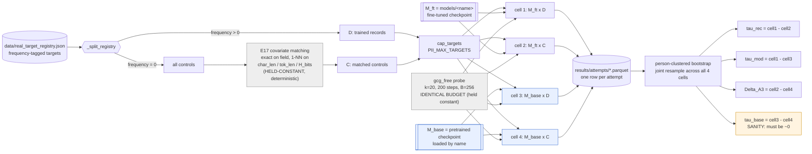
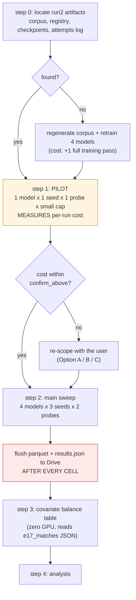

# Preregistration — convergent_validity_20260902

_Convergent-validity check on the calibrated memorization signal (E2 + E5). Type: `experiment`.
Status: in design._

> Written section by section during the design stage; each confirmed section replaces one
> `_pending_` marker. Preregistration exists because once results are visible, every human being
> alive — including the author — will find a story that fits them. Fixing the hypothesis, the metric,
> and the test beforehand costs nothing now and cannot be done afterwards.

## Question

E1 has already produced direct estimates of the two quantities this paper turns on: the forcing
floor `α_k = EMR(C)` and the calibrated signal `τ̂rec = EMR(D) − EMR(C)`. Both come from a single
route — hold the model fixed, vary whether the record was in the corpus.

**Does a second route, holding the records fixed and varying the model instead, reproduce the same
calibrated signal — and does the assumption that route depends on actually hold?**

| Route | Holds fixed | Varies | Estimates |
|---|---|---|---|
| **E1** (baseline, already run) | model `M_ft`, attack | the record's **membership** | `α_k`, `τ̂rec` |
| **E2** (this study) | the records, attack | the **model** (`M_ft` vs `M_base`) | `τ̂mod = EMR(D) − EMR_base(D)` |

The two rest on **different assumptions**, which is what makes agreement informative:

| Estimator | Depends on | Fails when |
|---|---|---|
| `τ̂rec` | **A1 exchangeability** — C is comparable to D in forcibility | C is harder to force ⇒ `τ̂rec` overstated |
| `τ̂mod` | **A3 domain monotonicity** — fine-tuning does not lower an excluded record's elicitability | fine-tuning lowers general forcibility ⇒ `τ̂mod` overstated |

**Population**: SSN and email targets on four self-fine-tuned models (GPT-2 124M/355M,
Pythia 1.4B/2.8B), one controlled synthetic corpus, seed(s) per the protocol.

### Why E5 is not in this study

A frequency dose-response arm (E5) was designed and removed before any compute was spent. Two
reasons, both fatal at the current corpus scale:

1. **The dose curve cannot be validated.** The corpus has three trained frequency tiers (1/5/20).
   Three points against a two-parameter curve leaves one degree of freedom, so the functional form
   cannot be tested — and extrapolating *outside* the observed range to f=0 depends entirely on that
   untested form.
2. **The tier that matters most is the smallest.** f=1 holds 10 individuals (20 targets). A direct
   f=20 versus f=1 contrast has a minimum detectable effect of roughly **47 percentage points** under
   person-clustered inference. An effect that large would already be visible in E1's single `τ̂rec`.

A third, more basic objection: "a trained record that appeared zero times" *is* a control record, so
comparing the extrapolated intercept against the control arm is close to tautological. The one thing
it could genuinely detect — controls not being exchangeable with trained records — has a direct and
**free** test: the covariate balance table required by Algorithm 1 step 2, computable from the
already-persisted `results/e17_matches_*.json`. That table is included in this study instead.

E5 becomes worthwhile only after the corpus is regenerated with balanced frequency tiers, which
requires retraining every model.

## Hypotheses

### H1 — the sandwich is consistent and the audit is valid

| | |
|---|---|
| **H0** | `τ̂rec` and `τ̂mod` estimate different quantities |
| **Direction** | `τ̂rec ≤ τ̂mod` (Proposition 4) |
| **Metric** | Both point estimates with 95% person-clustered bootstrap CIs, per model |
| **Refuted by** | `τ̂rec > τ̂mod` beyond their intervals |

This is Proposition 4's own falsification test. A reversed inequality means A1 or A3 has failed and
**the audit is invalid** — a result the paper's framework predicts is possible but has never checked.
Agreement pins `τ` and yields the interval `[τ̂rec, τ̂mod]`.

### H2 — A3 holds: fine-tuning does not reduce general forcibility

| | |
|---|---|
| **H0** | `EMR(C) = EMR_base(C)` |
| **Direction** | `EMR(C) ≥ EMR_base(C)` |
| **Metric** | Control-arm extraction rate on the fine-tuned model versus the base model, same records, same attack |
| **Refuted by** | `EMR(C) < EMR_base(C)` beyond the intervals |

Both arms here are records **neither model ever saw**, so any difference is attributable to what
fine-tuning did to the model's general forcibility — exactly the quantity A3 asserts about. **E2
therefore tests the assumption its own estimator depends on**, which `τ̂rec` cannot do for A1.

Refuting H2 means `τ̂mod` cannot serve as the upper bound in Proposition 4, and the sandwich collapses
to a single estimator.

### Sanity condition — the base model must show no signal

On the base model **both arms are never-trained**: it saw neither D nor C. The calibrated signal
there is therefore zero by construction:

```
τ̂_base = EMR_base(D) − EMR_base(C) ≈ 0
```

A significantly non-zero `τ̂_base` means the harness or E17's covariate matching is broken, and the
main results cannot be trusted. This is checked **before** H1 and H2 are read, and a failure blocks
the study rather than being reported as a finding.

## Prediction

_Recorded before any run. Its value lies precisely in being falsifiable after the fact._

### The researcher's prior

- **H1: the sandwich holds and the two estimators are close.** `τ̂rec ≤ τ̂mod` with a narrow bracket,
  i.e. the calibration method is validated and both routes agree.
- **H2: A3 holds, and in the strong direction** — `EMR(C) > EMR_base(C)`. Fine-tuning makes the model
  *more* forcible in general, plausibly because it has learned the surface form of the PII documents
  (labels, separators, the nine templates) even for records it never saw.

### The designer's estimate (for post-hoc comparison only; not the researcher's position)

| Quantity | Estimate | Basis |
|---|---|---|
| `EMR_base(C)` | Well below `EMR(C)`'s 39% | The base model has never seen the corpus's document formats; forcing a labelled SSN out of it should be harder |
| `EMR_base(D)` | Close to `EMR_base(C)` | The base saw neither arm, so both are pure forcing |
| `τ̂_base` | ≈ 0, CI containing 0 | Sanity condition; non-zero would indicate a broken harness |
| `τ̂mod` | Larger than `τ̂rec` | `τ̂mod = EMR(D) − EMR_base(D)`; if `EMR_base(D)` is well below `EMR(C)`, the gap is wider |
| H1 verdict | Holds, but with a **wide** bracket | Follows from the above — the two estimators agree in ordering but not in magnitude |

### Where the two differ

The researcher expects `τ̂rec` and `τ̂mod` to be **close**; the designer expects the same ordering but
a **wide** gap. The width of `[τ̂rec, τ̂mod]` is therefore the sharpest point of disagreement recorded
here, and it is exactly what Proposition 4 calls the interval estimate of `τ`. A narrow bracket is a
much stronger result for the paper than a wide one.

## What the Answer Changes

**The core: this is the first execution of Proposition 4's falsification test.** The paper proves the
sandwich theorem, marks `τ̂mod` as unmeasured (◦) in Table 2, and reports only the horizontal cut. A
theorem that has never been run against data is an assertion about what would happen, not a result.

| Outcome | Effect on the paper |
|---|---|
| **H1 supported, narrow bracket** | `τ̂mod` moves from ◦ to ✓ in Table 2; Proposition 4 gains an interval estimate of `τ`; the calibration is validated by a route that does not use the control records at all |
| **H1 supported, wide bracket** | Same, but the interval is weak evidence. Worth reporting honestly — a wide sandwich still bounds `τ` |
| **H1 refuted** (`τ̂rec > τ̂mod`) | **A1 or A3 has failed and the audit is invalid.** This would be the single most consequential negative result available to this project: it would say the paper's own calibrated numbers cannot be trusted until the failing assumption is identified and fixed |
| **H2 supported** | A3 holds; `τ̂mod` is a legitimate upper bound; and there is a concrete mechanism to report — fine-tuning raises general forcibility, which is itself a finding about what fine-tuning does |
| **H2 refuted** | `τ̂mod` cannot serve as the upper bound; the sandwich collapses to one estimator and Proposition 4 becomes inapplicable to this setting |
| **Sanity fails** (`τ̂_base` ≠ 0) | The harness or the covariate matching is broken. **Blocks the study** and casts doubt on E1's already-published numbers, since they share the same matching code |

**What the next study depends on**: if A3 holds and the bracket is narrow, the full 2×2 design is
validated and the capacity sweep (the abandoned `capacity_response_20260831`) can be revived on firm
ground. If the sanity condition fails, nothing else in the project proceeds until it is fixed.

## Variables

### Independent (manipulated)

| Variable | Levels | Note |
|---|---|---|
| **Model state** | `finetuned` / `base` | The new axis. `base` = the original pretrained checkpoint, loaded by name (`_load_model(..., state="base")`), so it genuinely never saw the corpus |
| **Membership** | `trained` (D) / `control` (C) | The E1 axis, retained so the design is fully crossed |

### Dependent (measured)

| Variable | Definition |
|---|---|
| `EMR` | Exact-match rate: fraction of (person, field) targets the probe forces the model to emit verbatim, under an identical budget and decision rule in every cell |
| `forward_passes` | Query cost per target; the budget-equality witness |
| `success_step` | GCG step at which the check first passed (right-censored at 200) |

### Controlled (held constant across all four cells)

Attack (`gcg_free`, k=20, 200 steps, B=256 candidates, 512 sampled evaluations) · decision rule (greedy generate, `T+20` tokens, `exact_match`) · target registry and the E17-matched control set · fields (SSN, email) · seeds · `PII_MAX_TARGETS`.

**Budget equality across cells is the load-bearing control.** The paper's central invariant is that D and C receive an identical budget; this study extends it to the model axis. A cheaper attack on the base model would manufacture `τ̂mod` out of nothing.

### Uncontrolled but recorded

GPU model (Colab varies per session) · wall-clock and accelerator-hours · queue and preemption events · `pip freeze` hash (the environment is not pinned — see Threats) · driver/CUDA version.

## Arms

A **fully crossed 2 x 2**. The top row already exists from E1's run2; the bottom row is what this
study runs.

|  | **D** (trained records) | **C** (E17-matched controls) |
|---|---|---|
| **`M_ft`** (fine-tuned) | `EMR(D)` — *existing (E1)* | `EMR(C)` = the forcing floor `α_k` — *existing (E1)* |
| **`M_base`** (pretrained) | `EMR_base(D)` — **new** | `EMR_base(C)` — **new** |

Every contrast the study needs is an edge of this square:

| Contrast | Name | Reads as |
|---|---|---|
| Top row | `τ̂rec` | Calibrated signal (E1's headline) |
| Left column | `τ̂mod` | Model-side estimator (Prop. 4 upper bound) |
| Right column | `Δ_A3 = EMR(C) − EMR_base(C)` | What fine-tuning did to general forcibility |
| Bottom row | `τ̂_base` | **Sanity: must be ≈ 0** |

### Sanity-check condition

The bottom row is the required known-in-advance condition. On `M_base` **both arms are
never-trained records**, so `τ̂_base = 0` by construction. A significantly non-zero value means the
harness or E17's matching is broken, and it is read **before** any other contrast.

### Why no additional control arm is needed

The usual objection — "the base model might just be worse at everything" — is answered by the square
itself rather than by a new arm: `EMR_base(C)` is exactly the base model's general forcibility, and
it is already a cell.

## Experiment Pipeline



Blue = the new cells this study runs. Grey = held constant. Amber = the sanity gate.

**The confound this diagram is drawn to expose**: the only thing that differs between cell 1 and
cell 3 is the model's weights. Registry, matching, capping, probe, budget, decision rule, and seed
all flow through the identical path. If any of them were re-derived per model — in particular if E17
matching depended on the target model — `τ̂mod` would not be a clean model contrast. It does not:
E17's features are computed under a fixed held-out reference model, so the matched control set is
**identical across all four cells**.

## Data

### Provenance

| Component | Source | Reproducible? |
|---|---|---|
| Fictitious individuals + PII | Faker, `Faker.seed(data_cfg.seed)` | **Yes**, deterministic |
| Negative controls | Faker, `seed + 1000` | **Yes**, deterministic |
| PII documents | Nine templates, `random.Random(data_cfg.seed)` | **Yes**, deterministic |
| Public passages | Wikipedia / PG-19 / arXiv, fetched over the network | **No** — upstream content can change |

No real personal data is involved. Every SSN, email, and name is Faker-generated and fictitious,
which is what makes publishing verbatim extraction strings in the paper permissible at all.

### Splits and the grouping unit

There is no train/test split in the usual sense; the split that matters is **D versus C**, and it is
determined by `frequency > 0` in the registry. The **grouping unit is `person_id`** — one individual
contributes up to two targets (SSN, email), and those two are not independent. Every interval in this
study resamples persons, never targets.

### The E17 matched control set

Controls are not the whole control pool: `_matched_control_entries` keeps only those E17 selects, so
C is exchangeable with D on `char_len`, `tok_len`, and `H_bits` (exact match on `field`).
Two properties, both verified in the code and both consequential:

1. **Matching is deterministic.** It uses no RNG; the `seed` argument only names the output file.
   The matched set is therefore identical across seeds *and* across the four cells — good for the
   contrast, but it means **control-selection variance is not captured by re-seeding** (see Threats).
2. **Matching is with replacement.** One control can be matched to several trained records, and
   `_matched_control_entries` de-duplicates by person, so `|C| ≤ |D|`. The realized arm sizes must be
   reported, not assumed equal.

### The covariate balance table (Algorithm 1, step 2 — zero compute)

`results/e17_matches_<run>_seed<seed>.json` already persists `char_len`, `tok_len`, and `H_bits` for
**both** sides of every matched pair. Algorithm 1 step 2 requires the auditor to report D-vs-C
overlap on these covariates and abort if it fails; the paper has never reported it.

This study computes and reports it: per field, matched-pair means and standardized mean differences
(SMD) for the three covariates, with the conventional |SMD| < 0.1 balance threshold. It is a **direct
test of A1** — the assumption `τ̂rec` depends on and which `τ̂rec` alone cannot check — and it costs
**no GPU time at all**, only a JSON read.

> **Blocking dependency**: `data/`, `models/`, and `results/` are all empty on the local machine.
> The corpus, the registry, the four fine-tuned checkpoints, and run2's attempt log live on Google
> Drive / Cheaha. Every number in the top row of the 2 x 2 comes from that log. **Locating it is the
> first protocol step**; if it is unrecoverable, the top row must be re-run, which requires the
> checkpoints, which requires the corpus. See Open Questions.

## Analysis Plan

### The identity that organizes the whole study

The four cell means are four numbers, so the four contrasts are not independent. Writing them out:

```
tau_rec   = EMR(D)      - EMR(C)
tau_mod   = EMR(D)      - EMR_base(D)
Delta_A3  = EMR(C)      - EMR_base(C)
tau_base  = EMR_base(D) - EMR_base(C)
```

gives, exactly and by construction:

```
tau_mod = tau_rec + Delta_A3 - tau_base
```

**Consequence 1.** Once the sanity condition holds (`τ̂_base ≈ 0`), the gap between the two sandwich
bounds *is* the A3 slack:

```
tau_mod - tau_rec  =  Delta_A3
```

So H1 and H2 are not two independent questions — **H1 holds if and only if H2 holds**, given the
sanity condition. That is a feature, not a redundancy: it means the sandwich's *width* has a
mechanistic interpretation ("how much more forcible fine-tuning made the model in general") rather
than being an unexplained interval.

**Consequence 2 — the recorded predictions are in tension.** The researcher predicted H1 with the two
estimators **close**, and H2 in the **strong** direction (`EMR(C) > EMR_base(C)`). The identity says
those cannot both be strongly true: a large `Δ_A3` *is* a wide bracket. Whichever way the data falls,
one of the two predictions gives ground — which is exactly what makes recording them worthwhile.

### Estimator and intervals

- **Estimator**: cell means are unweighted target-level exact-match rates; contrasts are differences
  of cell means.
- **Intervals**: person-clustered bootstrap, resampling unit `person_id`, **N = 10000**, seed
  `20240601` — the convention in `reporting.md`, implemented by `_cluster_emr_ci` /
  `_cluster_diff_ci`.
- **One joint bootstrap, not four.** Each replicate resamples persons **once** and recomputes all
  four cells on that same resample. This preserves the identity above inside every replicate, gives
  correct intervals for the *differences* between contrasts, and is the only way `τ̂mod − τ̂rec` gets
  an honest interval. Four independent bootstraps would not.
- **Degenerate arms**: where a cell is 0/n (run2 already has one: Pythia-2.8B's `EMR(C)` = 0/12), the
  bootstrap collapses. Switch that row to Newcombe (Wilson-score) and **mark it in the table note**,
  per `reporting.md`.

### Tests

| Hypothesis | Test |
|---|---|
| Sanity `τ̂_base ≈ 0` | Equivalence check: is the 95% CI contained in ±5 pp? Read **first**; failure blocks the study |
| H1 `τ̂rec ≤ τ̂mod` | One-sided: does the CI for `τ̂mod − τ̂rec` exclude 0 from below? |
| H2 `EMR(C) ≥ EMR_base(C)` | One-sided on `Δ_A3`; identical to H1 by the identity, reported for interpretability |
| Balance (A1) | Standardized mean difference per covariate per field; balance threshold \|SMD\| < 0.1 |

**Multiple comparisons**: the confirmatory family is {H1, H2} x {4 models} = 8 tests. **Holm** within
the family. The primary model is prespecified as **GPT-2 124M** (the smallest, hence the one with the
most targets completed per accelerator-hour); the other three are reported with corrected intervals
as supporting evidence.

### Power — read this before approving the budget

Approximate two-sided MDE at 80% power, α = 0.05, worst-case p = 0.5, with a design effect of 1.5
(two targets per person, ICC ≈ 0.5):

| Persons per arm | Independent contrast (`Δ_A3`) | Paired across models (`τ̂mod`), discordance 0.2 / 0.4 |
|---|---|---|
| 12 *(run2, Pythia-2.8B)* | **49.5 pp** | — |
| 25 *(run2, GPT-2)* | **34.3 pp** | 21.7 / 30.7 pp |
| 50 | 24.3 pp | 15.3 / 21.7 pp |
| 100 | 17.2 pp | 10.9 / 15.3 pp |
| 200 *(full registry)* | 12.1 pp | 7.7 / 10.9 pp |

**At run2's target count this design can only detect very large effects.** That is a design problem,
not a caveat to be written up afterwards, and it drives the budget decision below.

The paired column matters: `τ̂mod` compares the **same records** on two models, so it is the more
powerful of the two contrasts and is the one to lean on. `Δ_A3` is between-arm and therefore weaker,
even though the identity ties them together.

### The budget decision this forces

Cost scales as `targets x seeds x models x probes`. Three ways to spend the same compute, relative to
one run2-scale E1 pass (25 persons/arm, 1 seed, 4 models, 8 probes):

| Option | Config | Relative cost | MDE (paired, π_d=0.4) |
|---|---|---|---|
| **A — mirror run2** | 25 persons, 1 seed, 4 models, 8 probes | 1.0x | 30.7 pp |
| **B — trade probes for targets** *(recommended)* | 100 persons, 3 seeds, 4 models, **2 probes** (`gcg_free`, `fixed`) | 3.0x | **15.3 pp** |
| **C — seeds only** | 25 persons, 3 seeds, 4 models, 8 probes | 3.0x | 30.7 pp |

**Option B is recommended and C is rejected.** Extra seeds re-draw GCG's candidate sampling; they do
**not** reduce person-level variance, which is the dominant term here. Option C triples the cost and
moves the MDE by nothing. The eight-probe capacity axis is already E1's and E3's job — this study
needs the two endpoints, not the whole sweep.

Option B still satisfies the agenda's seed floor of 3, so no seed is being cut to buy targets.

> **If the top row must be re-run** (run2's log unrecoverable, or the target cap raised, which
> under Option B it is), E1 must be re-run at the identical configuration or the contrast is not
> paired. Budget Option B as **2 x 3.0x** = 6 run2-equivalents in that case. This is the single
> largest cost item in the study and it is decided by whether the run2 log is found.

### Reporting

Every cell reported as `(rate, floor)` with n; every contrast with a 95% CI and its n; the
covariate-balance table alongside. Every number in this study carries the exploratory mark `ᵉ` until
it reaches 3 seeds.

## Baselines & Prior Art

### The baselines are internal, and they are already specified

This study makes no claim of the form "our method beats theirs", so the relevant baselines are
**within-study reference conditions**, all of which are cells of the 2 x 2:

| Baseline | Role |
|---|---|
| `fixed` probe (zero-capacity) | The natural-prompt lower endpoint. Without it, a low `EMR_base` cannot be distinguished from "the base model emits nothing useful at all" |
| `EMR_base(C)` | General forcibility of the untrained model — answers "the base model is just worse at everything" without a new arm |
| `τ̂_base` | The known-answer sanity condition |

`fixed` is the trivial baseline the design would otherwise be missing, which is why Option B keeps
two probes rather than one.

### Prior art this study sits against

- **Proposition 4 (this paper)** is the direct antecedent: it proves the sandwich and marks `τ̂mod`
  as unmeasured (◦) in Table 2. This study supplies the missing measurement. The novelty claim is
  therefore modest and checkable — *first empirical execution of our own Proposition 4* — not a claim
  about the literature.
- **Placebo / negative-control designs** in causal inference are the general template for the
  base-model arm; the framing as a placebo cell is stated in `experiments.py`'s own docstring for E2.
- **Membership-inference calibration** work motivates `τ̂rec` as a distinguisher advantage. This study
  does not extend that literature; it validates one estimator against another within a fixed setup.

### What would make the claim illegitimate

Comparing `EMR_base` to any **published** extraction rate from another paper. Different corpus,
different budget, different decision rule — the whole point of the paper is that such rates are not
comparable without a floor. All comparisons here are internal, at matched budget, on the same
records.

## Reproducibility & Execution

### The five pins

| Pin | Status | Action |
|---|---|---|
| **Code** | git SHA of `exp/e2-e5`, clean tree enforced | Recorded per run in `results.json` |
| **Config** | `PII_PROBES`, `PII_MAX_TARGETS`, `PII_DEVICE_PROFILE`, `run_id` | Written to `configs/` and echoed into every run record |
| **Data** | corpus + registry, content-hashed | **See the blocking dependency** — the artifacts are not local |
| **Seed** | 3 seeds, values fixed in the protocol | Seeds `Faker`, `random`, `torch` |
| **Environment** | **NOT PINNED** | `requirements.txt` uses lower bounds only; record a `pip freeze` hash and list it as a threat |

### Determinism

Only **partial**. `_membership_sweep` seeds `random` and `torch`, which covers GCG's candidate
sampling, but no CUDA determinism flags are set and the GPU model varies per Colab session.
Bit-identical re-runs are **not** claimed; the claim is that the reported intervals are wider than
the residual nondeterminism, which the repro check tests.

**Repro check**: re-run one cell (GPT-2 124M, `M_base`, arm C, seed 0) on a second session and
confirm the EMR agrees within the bootstrap CI. Failure here invalidates every interval in the study.

### Execution



- **Environment**: Colab Pro as primary; `PII_DEVICE_PROFILE=auto` is **mandatory** (the assigned GPU
  differs per session and hardcoding `colab_pro` on a T4 will OOM). Cheaha `amperenodes-medium` for
  the two Pythia models if Colab sessions prove too short.
- **Preemption**: Colab sessions are reclaimed without warning and the filesystem is not persistent.
  Flush the attempt-log parquet and `results.json` to Drive **as each cell completes** — the
  methodology's hard gate. Retry cap 3 per cell, then escalate rather than looping.
- **Cost accounting**: `est_cost_usd = 0`; **accelerator-hours is the accounting unit**, and the GPU
  model is recorded on every run or the hours cannot be aggregated.
- **`confirm_above`**: currently a provisional 4 accelerator-hours. **The pilot's measured per-run
  cost replaces it before the main sweep launches** — that is the pilot's primary purpose.

### Artifacts

`results/attempts/*.parquet` (one row per attempt, the raw evidence) · `results/e17_matches_*.json`
(matching, and the balance table's input) · `results/tables/` (generated by `make_tables.py` only —
**no hand-transcribed numbers**, which is where two of the draft's existing inconsistencies came
from).

## Threats to Validity

### Internal

| Threat | Severity | Handling |
|---|---|---|
| **Tokenizer mismatch between `M_ft` and `M_base`** | Medium | Fine-tuning does not change the vocabulary for these four models, so the tokenizer is identical and targets tokenize identically. **Verify in the pilot** rather than assuming |
| **Budget not actually equal across cells** | High | The whole contrast dies if the base model gets a cheaper attack. Assert `forward_passes` distributions match across cells; report as a table |
| **LoRA vs full fine-tune confound** | Medium | GPT-2s are fully fine-tuned, Pythias use LoRA (a paper/code mismatch already logged in `CODE_MAP.md`). `Δ_A3` may differ in kind between the two families; analyze per model, never pooled |
| **Padding enters the loss unmasked** | Low here | A known defect affecting both cells identically, so it does not bias the contrast; it does affect absolute rates |

### External

- **Four models, one corpus, two fields.** Any claim generalizes to *these* fine-tunes, not to
  fine-tuning in general. The A3 result in particular is about what *this* fine-tuning recipe did.
- **Synthetic corpus.** Faker PII in nine templates is more regular than real documents, which
  plausibly inflates general forcibility on the fine-tuned model — i.e. may inflate `Δ_A3`.

### Construct

- **EMR is a substring/exact-match test on a greedy generation.** It measures "the optimizer forced
  this string out under this decision rule", not "the model retained the record". That gap is the
  paper's thesis and is not a defect of this study, but every sentence in the write-up must respect
  it.
- **A3 is asserted about elicitability in general; `Δ_A3` measures it on E17-matched controls only.**
  These coincide only if the matched controls are representative of the elicitability distribution.
  Stated as a limitation, not fixed.

### Conclusion

| Threat | Handling |
|---|---|
| **Underpowered at run2's target count** (MDE 34 pp) | **Addressed in the design**, not deferred: Option B raises targets to 100/arm. If the budget forces Option A, the study reports the MDE alongside every null and makes no "no difference" claim |
| **8 tests in the confirmatory family** | Holm correction; primary model prespecified |
| **Control-selection variance is invisible to seeding** | E17 matching is deterministic, so re-seeding does not perturb the control set. Every interval here conditions on one matched set. Sensitivity check: recompute with the 2nd-nearest neighbour and report whether conclusions move |
| **Environment not pinned** | `requirements.txt` uses lower bounds; a `pip freeze` hash is recorded, and "environment not pinned" is listed as a threat at analysis time |
| **Reading results before the sanity gate** | The gate is read first, by protocol. If `τ̂_base` is significantly non-zero the study is blocked, not reinterpreted |

## Success Criteria

**A refuted hypothesis satisfies every criterion below.** The study succeeds by producing a
trustworthy answer, not a favourable one.

1. **The sanity gate is read and reported** — `τ̂_base` with its CI, for every model, before any other
   contrast. Whether it passes or fails, it is in the write-up.
2. **All four cells are populated** at the agreed configuration, with matched `forward_passes`
   distributions demonstrated across cells.
3. **`τ̂mod` gets a point estimate and a person-clustered CI** for every model, from the joint
   bootstrap — enough to move it from ◦ to ✓ in Table 2 regardless of which direction it points.
4. **H1 and H2 are decided or explicitly declared undecidable at the achieved n**, with the MDE stated
   in the same sentence as any null result. "No detectable difference, MDE 24 pp" is a success;
   "no difference" is not.
5. **The covariate balance table is produced and reported** — SMDs for `char_len`, `tok_len`,
   `H_bits` per field, against the |SMD| < 0.1 threshold. This is Algorithm 1 step 2, executed for
   the first time.
6. **The repro check passes** — one cell re-run in a second session agrees within its CI.
7. **The cost is accounted** — accelerator-hours and GPU model per run, failed-run cost reported
   separately.

### Explicitly not success criteria

- `τ̂mod` being large, or `τ̂rec ≤ τ̂mod` holding. A reversed sandwich is the **most valuable** outcome
  available here: it would show the audit is invalid, which is a result the paper's own framework
  predicts and has never checked.
- A narrow bracket. The bracket's width is `Δ_A3`, a measured quantity, not a quality score.

## Open Questions for the Protocol

1. **Where are run2's artifacts?** `data/`, `models/`, and `results/` are empty locally. The corpus,
   registry, four checkpoints, and `results/attempts/*.parquet` must be located on Drive or Cheaha.
   **This is the top-priority blocker**: the entire top row of the 2 x 2 comes from that log, and if
   it is gone the study's cost doubles (E1 re-run) or worse (retraining). *Asked and unanswered so
   far.*
2. **Option A, B, or C?** The recommendation is **B** (100 persons/arm, 3 seeds, 4 models, 2 probes,
   ~3x a run2 pass — or ~6x if E1 must be re-run to match). Needs the user's decision and, given
   Option B raises `PII_MAX_TARGETS`, it forces the E1 re-run regardless of question 1.
3. **What does one GCG attack actually cost?** No run has been measured. `confirm_above` is a
   placeholder at 4 accelerator-hours. The pilot answers this and the number is fixed before the
   main sweep.
4. **Which three seeds?** Fix the values in the protocol so the preregistration is checkable.
5. **Is the public-passage fetch reproducible?** `fetch_public_passages` hits the network; if the
   corpus must be regenerated, upstream drift may change it. Check whether a cached copy exists
   alongside the checkpoints.
6. **Does `EMR_base` risk being 0 in every cell?** If the base model refuses every target, `τ̂mod`
   degenerates to `EMR(D)` and both cells lose their bootstrap. The pilot should report base-model
   rates first; if they are 0/n, switch those rows to Newcombe and say so in the table note.
7. **`ε̂` has no implementation.** Table 2 marks it ✓ but no code computes it. Out of scope here, but
   it is ~10 lines and this study's outputs are exactly its inputs — flag for the follow-up.

## Deviations

_(Empty at design time. If execution must depart from this preregistration, append a dated entry
here.)_
