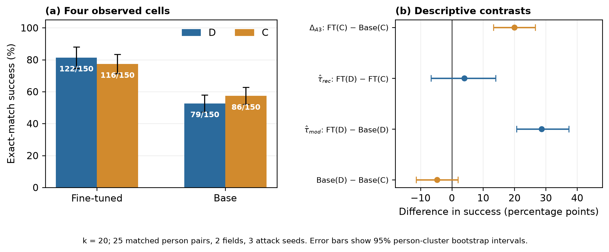

# GPT-2 base-model follow-up at k=20

## Summary

Using exactly the 25 frozen E3b D/C person pairs, two fields, and three
attack seeds, we attacked the original GPT-2 base checkpoint with the same
`k=20` GCG configuration as the accepted fine-tuned E3b run. The new base row
and reused fine-tuned row form a complete **observed** 2-by-2 table. Here D
and C keep their frozen target-group labels; the base checkpoint was not
fine-tuned on either group. Control
success is 77.3% after fine-tuning versus 57.3% on the base checkpoint:
`Delta_A3 = +20.0` percentage points, 95% matched-person-cluster bootstrap
interval `[+13.3, +26.7]`. This supports the prospectively recorded positive
direction on this checkpoint. The fine-tuned D−C contrast is only `+4.0` points
`[-6.7, +14.0]`; these data do not isolate memorization or establish a causal
sandwich interval.

## Ledger audit

| Gate | Result |
|---|---|
| Completeness | 3 base + 3 previously accepted fine-tuned `k=20` shards; 100 attempts/shard, 600 formal attempts; all 25 D/C pairs × 2 fields × 3 seeds in each model state |
| Scheduler and outcomes | New jobs 40461513/14/15 each `COMPLETED`, exit `0:0`; all 3 reused fine-tuned jobs also `COMPLETED/0:0`; no failed formal run |
| Source and pins | Frozen target manifest, formatted target hashes, pair assignment, registry/corpus/fine-tuned source fingerprints, environment lock, A100 model, optimizer budget, decoding and exact-match rule pass; base checkpoint fingerprint is pinned |
| Code comparability | Fine-tuned commit `c7e4416`, base-runner commit `7d95b22`; `experiments.py`, `gcg_attack.py`, `config.py`, `attempt_log.py`, `run_manifest.py`, and `e3_target_manifest.py` have no diff between them |
| Reproducibility | Two 8-attempt pilots had identical target strings, prompts, generations, success decisions, step counts and NLL values; observed drift 0, accepted tolerance 0.001 |
| Exclusions | Both two-pair pilots remain in `results.json` but were prospectively excluded from formal inference; no formal result excluded |
| Replication unit | 25 matched person pairs; three seeds repeat attacks on the same model and targets, not three independently trained checkpoints. This is below the lab's default five-seed target but meets its hard floor of three attack seeds. |

The source E3b study is the accepted field-exposure-corrected dataset. The
historical `CODE_MAP.md` header predates E3b and is used only as a routing and
threat checklist, not as authority for the present run's status.

## Prospectively specified result

The registered prediction was `EMR_finetuned(C) - EMR_base(C) >= 0` at `k=20`.
Each cell contains 150 attempts (25 people × 2 fields × 3 attack seeds), but
the bootstrap resamples the **25 matched person pairs**, retaining all fields
and seeds within a pair. Intervals are percentile 95% intervals from 10,000
resamples at fixed seed 20260923; they are conditional on this one model pair
and fixed set of attack seeds. No global p-value or multiple-testing claim was
preregistered for this focused follow-up.

| Model state | D exact matches | C exact matches |
|---|---:|---:|
| Fine-tuned GPT-2 (reused accepted E3b) | 122/150 = 81.3% [74.7, 88.0] | 116/150 = 77.3% [71.3, 83.3] |
| Original GPT-2 base (new) | 79/150 = 52.7% [47.3, 58.0] | 86/150 = 57.3% [52.0, 62.7] |

The primary observed contrast is **`Delta_A3 = FT(C) - Base(C) = +20.0` pp
`[+13.3, +26.7]`**. The registered nonnegative direction holds, and this
person-cluster interval lies above zero. It shows that fine-tuning changed
how readily the attack elicited *excluded control targets*. It does not by
itself prove that adding any single trained record causes that change, or that
domain monotonicity holds for every target.

## Four-cell diagnostic

| Observed contrast | Definition | Estimate, 95% cluster interval |
|---|---|---:|
| `tau_rec` | FT(D) − FT(C) | +4.0 pp [−6.7, +14.0] |
| `tau_mod` | FT(D) − Base(D) | +28.7 pp [+20.7, +37.3] |
| `Delta_A3` | FT(C) − Base(C) | +20.0 pp [+13.3, +26.7] |
| `tau_base` | Base(D) − Base(C) | −4.7 pp [−11.3, +2.0] |
| `tau_mod − tau_rec` | `Delta_A3 − tau_base` | +24.7 pp [+16.7, +32.7] |

The two observed estimators have the proposed order (`tau_rec < tau_mod`),
but the **population causal sandwich proposition remains conditional** on
exchangeability, no interference, domain monotonicity and consistency. The
base checkpoint differs from the fine-tuned checkpoint by the entire
fine-tuning process; it is not the counterfactual model trained on the same
corpus with just one D target removed. Thus the observed order is a diagnostic
of model-state effects, not a verified bound on the per-record causal effect
`tau`.

Figure: `k=20`; 25 matched D/C person pairs, two fields, three attack seeds
per model state. Error bars are 95% percentile intervals from resampling
matched person pairs (10,000 replicates). The base row is new; the fine-tuned
row is reused accepted E3b evidence. The D label in the base row identifies
the same target group, not a target trained into the base model. The graph is
descriptive and does not
display a causal sandwich interval.

## Exploratory findings

| Exploratory field split | Fine-tuned D | Fine-tuned C | Base D | Base C |
|---|---:|---:|---:|---:|
| SSN (exploratory) | 47/75 | 41/75 | 13/75 | 15/75 |
| Email (exploratory) | 75/75 | 75/75 | 66/75 | 71/75 |

Fine-tuned email extraction is at a 75/75 ceiling in both arms. Most of the
observed control increase is in SSN (41/75 fine-tuned versus 15/75 base),
while email is 75/75 versus 71/75. These field patterns were not given a
separate prospective test and are not confirmatory findings. The three
seed-specific pooled control differences are +14, +12, and +34 points;
they are repeated attacks on the same checkpoint, not training replications.

## Deviations and cross-checks

No run was dropped or attack parameter changed after seeing outcomes. The
analysis implementation fixed the 10,000-resample person-pair bootstrap and
its random seed before the formal results were retrieved; the design had
specified person-clustered uncertainty but not a replicate count. An
independent 100,000-resample calculation confirmed all cell counts and effect
directions. Its `tau_mod` lower endpoint is +20.0 rather than +20.7 points,
one discrete bootstrap step; the other reported endpoints agree. See
[`statistics_review.md`](statistics_review.md). The older E3b H3 report used
separate D and C person blocks, so its interval for the fine-tuned D−C
contrast need not equal this matched-pair bootstrap interval.

The stale `CODE_MAP.md` flags prior E3a exposure and matching defects. This
follow-up uses the accepted E3b corrected target manifest, so the historical
48/50 exposure issue does not carry into these 50 D field targets. Matching
on observed length/token/self-information features still cannot guarantee
exchangeability on unmeasured forcibility. The code map's earlier claim that
E2 never ran describes the older generic four-model design and predates this
focused GPT-2 follow-up.

## Predictions versus outcomes

| Task | Predicted before running | Observed | Status |
|---|---|---|---|
| Pilot | Eight complete, pinned attempts on one A100 | Both pilots completed 8/8; identical outputs and clean pins | Held |
| Formal primary | `Delta_A3 >= 0` | +20.0 pp [13.3, 26.7] | Direction held on this checkpoint |
| Four-cell diagnostic | Observed order can assess plausibility but not identify causal `tau` | `tau_rec=+4.0` pp and `tau_mod=+28.7` pp; order holds | Descriptive only |

## Compute

The three new base formal jobs consumed **2.716 A100 GPU-hours** in SLURM
(53:04, 54:27, 55:26). The two A100 pilots consumed **0.196 hours**. Total
new allocation for this follow-up is **2.911 A100 GPU-hours**, below the
approved 5.0-hour ceiling, with no failed jobs and estimated marginal dollar
cost recorded as zero for the academic cluster. The reused fine-tuned E3b
`k=20` jobs historically consumed **1.691 A100 GPU-hours**; this is comparison
provenance, not additional spend by the follow-up.

## What this does not show

- It does **not** identify the effect of including or excluding one D record
  from otherwise identical fine-tuning, so it does not validate the causal
  sandwich interval or assumption A1/A2/A3 as general truths.
- A D−C interval containing zero does **not** establish that trained and
  control targets are equivalent or that no memorization exists.
- It does **not** estimate empirical differential-privacy `epsilon`, certify a
  low-false-positive operating point, validate a honeytoken defense, or
  support NLL/AUC/ROC membership claims.
- One checkpoint, two synthetic fields, 25 person pairs, and three attack
  repeats do not support generalization across training runs or model families.

## Manuscript implication

The paper may report the new base-model row and the positive control-model
shift as a focused GPT-2 diagnostic beside the existing E3b capacity result.
It should no longer say that *no* base-model arm has been run. It must still
state that the full per-record causal sandwich has not been identified. The
abstract need not change before the authors review this focused addition.
